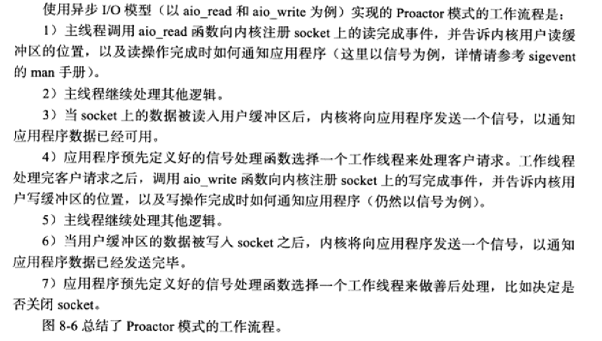
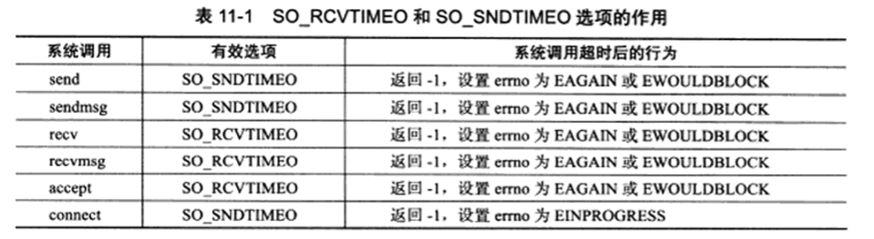

### ICMP报文格式

类型主要分为两类,**差错报文**和**查询报文**
### 以太网帧


### arp请求报文


### dns报文

Linux在/etc/resolv.conf文件存放dns服务器地址

### ipv4头部

### icmp重定向报文

### ipv6报文

### tcp头部

### service脚本程序

### http请求方法

```http
//http请求格式:
GET http://www.baidu.com/index.html HTTP/1.0    //请求行
User-Agent: Wget/1.12 (linux-gnu)               //2-4为头部字段,可按任意顺序排列
Host: www.baidu.com
Connection: close
//所有头部之后,必须以一个空行,标识头部结束,只包含一个回车符'\r'和一个换行符'\n'
//空行之后为消息体,如果非空,头部需包含消息体长度字段:"Connect-Length"
```


### http状态码

```http
HTTP/1.0 200 OK                 //状态行
Server: BWS/1.0                 //2-7头部字段
Content-Length: 8024
Content-Type: text/html;charset =gbk
Set-Cookie: BAIDU=4c5a6cb6at6bda7....: FG=1; expires=Wed,04 -Jul-42 00:10:47 GMT; path=/; domain=.baidu.com
Via: 1.0 localhost (squid/3.0 STABLE)
```


### 5.1.1 主机字节序和网络字节序
根据装载的顺序不同分为大端字节序和小端字节序
大端字节序:一个整数的高位23~31bit存储在内存中的低地址处,小端字节序则反之.现代计算机通常采用小端字节序,由此格式化的数据在两台不同字节序的主机之间传输,需要更改为同一大端字节序,接收端主机根据自身字节序决定是否转换.
### 5.1.2 主机字节序和网络字节序
socket网络编程的socket地址结构体:sockaddr
```C++
#include<bits/socket.h>
struct sockaddr{
    sa_family_t sa_family;
    char sa_data[14];
};
```
```sa_family_t```是地址族类型.地址族类型通常和协议族类型对应:

```PF_*和AF_*```宏定义在```bits/socket.h```中,且值完全相同,所以有时可以混用.
但是不同协议族的地址值有不同的含义和长度

因此Linux定义了新通用socket地址结构体:
```C++
#include<bits/socket.h>
struct sockaddr_storage{
    sa_family_t sa_family;
    unsigned long int __ss_align;
    char __ss_padding[128-sizeof(__ss_align)];
}
```
保证有足够大空间存放ip地址并且内存对齐.()

### 5.1.3 专用socket地址


## 6. 各种函数
### 6.1 `splice`(是一个零拷贝操作.)
```C++
#include<fcntl.h>
ssize_t splice( int fd_in, loff_t* off_in, int fd_out, loff_t* off_out, size_t len, unsigned int flags);
```
> fd_in为要读取数据的描述符.如果其是管道,则off_in必须为NULL,如果不是管道描述符,则off_in表示从输入数据的何处开始读取数据.off_out则意义类似,用于输出描述符,len参数指定移动数据的长度,就是读多少个字节的数据.
> * flag控制数据如何移动
> `SPLICE_F_MOVE`:如果合适的话,按整页内存移动数据.
> `SPLICE_F_NONBLOCK`:非阻塞的操作,实际受描述符的阻塞状态影响
> `SPLICE_F_MORE`:给内核提醒,表示后续将移动更多数据.
> `SPLICE_F_MORE`:没有效果.
>
> * `fd_in`和`fd_out`至少有一个需要是管道描述符.

### 服务器程序实例

```C++
//HTTPSERVER EXAMPLE
#include<sys/socket.h>
#include<netinet.h>
#include<arpa/inet.h>
#include<assert.h>
#include<stdio.h>
#include<unistd.h>
#include<stdlib.h>
#include<errno.h>
#include<string.h>
#include<sys/stat.h>
#include<sys/types.h>
#include<fcntl.h>

#define BUFFER_SIZE 1024

static const char* status_line[2] = {"200 OK", "500 Internet server error"};

int main(int argc, char* argv[]){
    if(argc <= 3){
        printf(" usage: %s ip_address port_number filename\n", basename(argv[0]));
        return 1;
    }
    const char* ip = argv[1];
    int port = atoi(argv[2]);
    const char* file_name = argv[3];//target filename;

    struct sockaddr_in address;
    bzero(&address, sizeof(address));
    address.sin_family = AF_INET;
    inet_pton(AF_INET, ip, &address.sin_addr);
    address.sin_port = htons(port);

    int sock = socket(AF_INET, SOCK_STREAM, 0);
    assert(sock != -1);

    int ret = bind(sock, (struct sockaddr*)&address, sizeof(address));
    assert(res != -1);

    ret = listen(sock, 5);
    assert(res != -1);

    struct sockaddr_in client;
    socklen_t clilen = sizeof(client);
    int connfd = accept(sock, (struct sockaddr *)&client, &clilen);
    if(connfd < 0)
        printf("errno is %d\n", errno);
    else{
        char header_buf[BUFFER_SIZE];
        memset(header_buf, '\0', BUFFER_SIZE);
        char *file_buf;
        struct stat file_stat;
        bool valid = true;
        int len = 0;
        if(stat(file_name, &file_stat) < 0)
            valid = false;
        else{
            if(S_ISDIR(file_stat.st_mode))
                valid = false;
            else if(file_stat.st_mode & S_IROTH){
                int fd = open(file_name, O_RDONLY);
                file_buf = new char[file_stat.st_size + 1];
                memset(file_buf, '\0', file_stat.st_size + 1);
                if(read(fd, file_buf, file_stat.st_size) < 0)
                    valid = false; 
            }
            else
                valid = false;
        }
        if(valid){如果文件有效
            ret = snprintf(header_buf, BUFFER_SIZE - 1, "%s %s\r\n", "HTTP/1.1", status_line[0]);
            len += ret;
            ret = snprintf(header_buf + len, BUFFER_SIZE - 1 - len, "Content-Length: %d\r\n", file_stat.st_size);
            len += res;
            ret = snprintf(header_buf + len, BUFFER_SIZE - 1 - len, "%s", "\r\n");

            struct iovec iv[2];
            iv[0].iov_base = header_buf;
            iv[0].iov_len = strlen(header_buf);
            iv[1].iov_base = file_buf;
            iv[1].iov_len = strlen(file_buf);
            ret = writev(connfd, iv, 2);
        }
        else{//如果文件无效,则
            ret = snprintf(header_buf, BUFFER_SIZE - 1, "%s %s\r\n", "HTTP/1.1", status_line[1]);
            len += ret;
            ret = snprintf(header_buf + len, BUFFER_SIZE - 1 - len, "%s", "\r\n");
            send(connfd, header_buf, strlen(header_buf), 0);
        }
        close(connfd);
        delete[] file_buf;

    }
    close(sock);
    return 0;
}
```
**fcntl函数**
```C++
#include<fcntl.h>
int fcntl( int fd, int cmd, ...);
```
cmd指定操作,通常设置为宏,具体不赘述,

## Linux服务器程序规范
* 一般为后台程序.称作守护进程daemon,没有控制终端,因此也没有意外输入
* 程序有日志系统,能输出日志到文件,在/var/log下通常拥有自己的日志目录.
* 一般以某个非root身份运行.比如,mysqld,httpd,syslogd,分别拥有运行账户mysql,apache,syslog,
* 可配置,服务器程序有配置文件,放在/etc目录下,例如squid的放在/etc/squid3/squid.conf
* 启动时生成一个PID文件存入/var/run目录中,例如syslogd,在/var/run/syslogd.pid.

## Linux系统日志
### 7.1 rsyslogd,(syslogd升级版)
不仅能接受进程日志,也能接收内核日志.
**用户通过调用`syslog`函数生成系统日志**,将日志输出到UNIX类型socket的文件/dev/log中,rsyslog监听该文件.
**内核日志**通过`printk`函数打印至**内核环状缓存**中,内容映射到/proc/kmsg文件中,rsyslog读取该文件获取内核日志.

**默认情况** 调试信息输出到/var/log/debug,其他消息/var/log/messages,内核/var/log/kern.log
**配置文件**/etc/rsyslog.conf 主要项:内核日志输入路径,是否接受UDP日志及其监听端口,(端口对应保存在/etc/services中),是否接受TCP日志及其监听端口,日志文件的权限,包含的子文件(/etc/rsyslog.d/*.conf),
**`syslog`函数**
```C++
#include<syslog.h>
void syslog(int priority, const char* message, ...);
```
* `priority`参数是所谓的*设施值与日志级别的按位或.设施值的默认值是LOG_USER,
日志级别: `LOG_EMERG`, `LOG_ALERT`,`LOG_CRIT`,`LOG_ERR`,`LOG_WARNING`,`LOG_NOTICE`,`LOG_INFO`,`LOG_DEBUG`;
**`void openlog( const char *ident, int logopt, int facility);`**
* ident 指定的字符串被添加到日志消息的日期和时间之后,通常被设置为程序的名字.
* logopt参数对后续的,syslog调用行为进行配置.可按下列值按位或:`LOG_PID`,`LOG_CONS`,`LOG_ODELAY`,`LOG_NDELAY`
* facility参数修改syslog中的默认设施值
* 设置日志掩码,使日志级别大于日志掩码的日志信息被忽略.: **`int setlogmask(int maskkpri);`** 该函数始终会成功,返回调用进程先前的掩码值.**`void closelog();`** 关闭日志功能.
### 7.2 UID, EUID, GID, EGID
启动身份和运行身份可能不同,身份对于**安全性来说很重要**
```C++
#include<sys/types.h>
#include<unistd.h>
uid_t getuid();    uid_t geteuid();
gid_t getgid();    gid_t getegid();
int setuid(uid_t uid);  int seteuid(uid_t uid);  
int setgid(gid_t uid);  int setegid(gid_t uid); 
```
**一个进程拥有两个id:uid和euid,**
euid方便用户资源访问.:*使得运行程序的用户拥有该程序的有效用户的权限* 比如su程序,任何用户运行之后可以获得root权限,如改账户时,su程序不得不访问**需要root权限的/etc/passwd**文件.

### 7.3 进程间关系
**1. 进程都隶属于一个进程组**
```C++
#include<unistd.h>
pid_t getpgid(pid_t pid);
```
* 进程有进程首领,其PID和PGID相同.
* `int setpgid(pit_t pid, pit_t pgid);
if pid == pgid, pid的进程为组首领, if pid == 1,当前进程PGID为pgid, if pgid == 0,则使用pid作为目标pgid,
* 进程只能设置子进程pgid,当子进程调用exec之后无法设置pgid,

**2. 会话**
```C++
pid_t setsid(void);
```
* 首领无法调用该函数.
* 非首领进程调用:
* 1. 调用进程变为**会话首领**.并为唯一成员
  2. 新建一个进程组,pgid即为该pid,
  3. 调用进程将甩开终端(如果有).
提供`pid_t getsid(pid_t pid)`来读取sid.

**3. ps命令查看进程关系**
`ps -o pid,ppid,pgid,sid,comm | less`

**4. 系统资源设置**
```C++
#include<sys/resource.h>  
int getrlimit(int resource, struct rlimit *rlim);
int setrlimit(int resource, const struct rlimit *rlim);
struct rlimit{
    rlimit_t rlim_cur;
    rlimit_t rlim_max;
};
```
rlim_cur是软限制,最好不要超越,不然系统可能会发终止信号给进程等.
rlim_max是硬限制,是上限,普通程序可以减少该值,root程序可以增大.


**5. 改变工作目录和根目录**
web服务器根目录一般是/var/www
```C++
#include<unistd.h>
char * getcwd( char* buf, size_t size);
int chdir( const char * path);
```
getcwd给buf指向的地方存储当前工作目录绝对路径名.如果路径名超出size返回NULL,设置errno为ERANGE,
* 如果buf为NULL,并size不为零,函数内部动态分配给buf,这个需要后期自己delete[],
* 成功后返回一个指针指向目标存储区,失败返回NULL设置errno
* chdir失败返回-1并设置errno
```C++
int chroot(const char* path);
```
不改变当前工作目录,需要再次调用chdir("/")进入逻辑根目录.

**6. 服务器后台化**
```C++
bool daemonize(){
    pid_t pid = fork();
    if(pid < 0){
        return false;
    }
    else if(pid > 0){
        eixt(0);//父进程退出
    }
    
    //子进程部分.
    /*设置文件权限码,当进程创建新文件,(open(const char* pathname, int flags, mode_t mode),文件的权限是 mode &0777*/
    umask(0);

    /*创建新会话*/
    pid_t sid = setsid();
    if(sid < 0){
        return false;
    }

    /*切换工作目录*/
    if( (chdir("/") < 0)){
        return false;
    }

    close(STDIN_FILENO);
    close(STDOUT_FILENO);
    close(STDERR_FILENO);
    /*关闭其他文件描述符(主要是从父进程继承过来的)*/
    open("/dev/null", O_RDONLY);
    open("/dev/null", O_RDWR);
    open("/dev/null", O_RDWR);
    return true;
}
```
*LInux库函数*
```C++
#include<unistd.h>
int daemon( int nochdir, int noclose);
```
nochdir 为0的话,工作目录设置为"/"
noclose 为0的话,标准输入标准输出标准错误输出都重定向到/dev/null

## 8 服务器程序框架
基本框架

* I/O处理单元一般是接入服务器.实现负载均衡.
* 逻辑单元通常是进程或线程.服务器通常拥有多个逻辑单元.  
* 网络存储单元:数据库.缓存.文件等.(非必须)
* 请求队列是一个抽象概念.I/O如何通知逻辑单元,逻辑单元如何访问网络存储而不冲突就是请求队列需要解决的问题.
通常预先建立,为静态,永久的,通常被实现为池的一部分.
### I/O模型
**I/O复用通常向内核注册一组事件,内核通过I/O复用函数把其中就绪的事情通知应用程序.**
**I/O复用函数本身是阻塞的,关键在于能够监听多事件**

### reactor模式:
* 主线程(I/O处理单元):只负责监听文件描述上是否有事件发生,有的话就通知工作线程(逻辑处理单元)


### proactor模式:
**所有I/O操作都交给主线程和内核执行.**
**异步I/O**


### 半同步/半异步模式
**并发中的概念**
* 同步:完全按照代码顺序执行
* 异步:执行需要**系统事件**驱动:如中断,信号等.
同步方式运行的线程称为**同步线程**,异步方式则称**异步线程**
* 异步线程复杂,难度大,效率高,实时性强.不适合高并发.
服务器通常采用**半同步/半异步**

* 半同步/半异步
同步用于逻辑处理.异步用于I/O处理.


### 领导者追随者模式

* **句柄集:**句柄Linux下是fd,句柄集管理众多句柄.使用wait_for_event来监听句柄上的I/O事件.并将就绪事件通知给领导者**线程**
* **:线程集**所有工作线程管理者.负责线程间同步/新领导者线程选定
线程三状态:
> * Leader
等待句柄集上I/O事件
> * Processing
正在处理事件,领导者接收到I/O事件之后,转移到本状态,并调用promote_new_leader选定新的领导者.
当processing状态完成如果没有领导者则它变为领导者.否则为追随者.
> * Follower
处于追随者身份.通过调用线程的join方法等待称为新的领导者.也有可能被指派任务.

### 有限状态机
**这是逻辑单元内部的一种高效方法**
有的应用层协议头部包含类型字段.**类型映射为逻辑单元的执行状态.**
* 状态之间的转移需要状态机内部驱动.
### 池
提前分配资源以便调用,省去了频繁调用内核的开销.
1. **内存池**
通常用于socket的接收缓存和发送缓存.对于**有限长度**的用户请求,预先分配一个够大的空间,如果用户请求长度超过,则动态分配.
2. **进程池和线程池**
用于并发编程.fork()和pthread_create();
3. **连接池**
用于服务器和内部机群的永久连接.
### 避免数据复制
比如服务器给客户机传输数据时,无需读取文件然后调用send,只需利用sendfile交给内核进行零拷贝发送.
进程之间需要传递大量数据时,应使用共享内存.
### 上下文切换和锁.
并发程序需要考虑的点.
* 进程或线程切换导致过多资源开销.
* 共享资源的保护.加锁通常会导致服务器效率低下
如果必须使用锁,考虑减小锁的粒度.例如读写锁.当程序都读取时,并不会增加额外开销,而有写操作时,才会锁住.

## I/O复用.
*需要使用的场合*
* 同时处理多个socket
* 同时处理用户输入和网络连接
* TCP服务器同时处理监听socket和连接socket(是I/O复用最多的场合)
* 同时处理TCP/UDP请求.
* 同时监听多个端口,处理多种服务.
### POLL模型.
```C++
#include<sy/epoll.h>
int epoll_create(int size);
//size不起作用.告诉内核需要多大.返回一个fd,
//该fd将用于其他所有epoll函数的第一个参数.
```
```C++
//从操作内核事件表
int epoll_ctl(int epfd, int op, int fd, struct epoll_event* event);
struct epoll_event{
    __unit32_t events;      /*events事件*/
    epoll_data_t data       /*用户数据*/
};
typedef union epoll_data{
    void * ptr;
    int fd;
    unit32_t u32;
    uint64_t u64;
}epoll_data_t;
```
**op的类型**
* EPOLL_CTL_ADD 往epfd上注册fd上的事件
* EPOLL_CTL_MOD 修改fd上的事件
* EPOLL_CTL_DEL 删除事件.
#### epoll_wait函数
```C++
#include<sy/epoll.h>
int epoll_wait(int epfd, struct epoll_event* events, int maxevetns, int timeout);
//成功返回就绪的描述符个数.失败-1并设置errno
```
**和poll的区别**
内核将所有就绪的事件从内核表中**复制到**events指向的数组中.(网上很多地方说不复制的,难道是错了吗)
#### LT和ET模式
**LT**模式:只要是高电平就一直触发(即epoll_wait一直向应用程序通告该事件),应用程序可以一直等到合适时机处理.
**ET**模式:只有边沿触发,也就是说第一次才会通告(只通告一次,因此效率比较高)
***注意采用ET模式的描述符应该都是非阻塞的***
### EPOLLONTSHOT事件
**缺点:**并发程序中可能对同一个fd的多次读取采用多个进程或线程.(前一个处理时,fd又有数据可读,因此唤醒有一个进/线程处理)
**保证一个fd只被一个线程处理**
```C++
//处理例子
void reset_oneshot{
    epoll_event event;
    event.data.fd = fd;
    event.events = EPOLLIN | EPOLLET | EPOLLONESHOT;
    epoll_ctl(epfd, EPOLL_CTL_MOD, fd, &event);
}
```

***三种模型区别***
* **SELECT**
没有将描述符和对应事件绑定,只能塞入对应队列日rdset,wrset,exceptset,对应读写和异常三种事件不能处理更多事件,另外内核对fd_set进行修改,必须重置才能再次使用.
* **POLL**
将事件和描述符定义在pollfd中,而且用revents返回触发的条件,无需重置events.但是需要对N个描述符轮询(EPOLL则是回调)
* **EPOLL**
在内核中维护事件表.采用系统调用函数epoll_ctl进行添加删除和修改操作.并直接从内核中获得注册的事件,epoll_wait仅返回就绪的事件,复制到events参数对应地址中.时间复杂度O(1)
*但是*当活动连接比较多时,epoll_wait效率未必高,因为回调触发较为频繁.因此适用于多连接较少活跃的情况.
* EPOLL和POLL都能达到系统最大文件描述符65535(/proc/sys/fs/filemax),select通常有限制.
* EPOLL可以采用高效ET方式


### 非阻塞connect
`EINPROGESS`: `errno` 在`connect`出错时的一种值.发生于对非阻塞`socket`调用`connect`;而连接又没有**立即建立**
&emsp;此时可以用`select`和`poll`等来监听该`socket`的**可写事件.**返回后再利用`getsockopt`读取错误码,并清除错误.
### ***聊天室程序*** ***处理网络连接和用户输入***
```C++
#define _GUN_SOURCE 1
#include<sys/types.h>
#include<sys/socket.h>
#include<netinet/in.h>
#include<arpa/inet.h>
#include<assert.h>
#include<stdio.h>
#include<unistd.h>
#include<string.h>
#include<stdlib.h>
#include<poll.h>
#include<fcntl.h>


#define BUFFER_SIZE 64
int main(int argc, char* argv[])
{
	if( argc <= 2 ){
		printf("usage : %s ip_address port_numer\n", basename(argv[0]));
		return 1;
	}
	const char* ip = argv[1];//表示要连接的服务器的ip地址.
	int port = atoi(argv[2]);//表示要连接的服务器的端口.
	
	struct sockaddr_in servaddr;
	bzero(&servaddr, sizeof(servaddr));
	servaddr.sin_family = AF_INET;
	inet_pton(AF_INET, ip, &servaddr.sin_addr);
	servaddr.sin_port = htons(port);
	
	int sockfd = socket(AF_INET, SOCK_STREAM, 0);
	assert(sockfd > 0);
	if( connect( sockfd, ( struct sockaddr* )&servaddr, sizeof( servaddr )) < 0 )
	{
		printf( "connection falied\n" );
		close(sockfd);
		return 1;
	}

	pollfd fds[2];
	fds[0].fd = 0;              //标准输入描述符
	fds[0].events = POLLIN;     //用于监控客户端键盘输入
	fds[0].revents = 0;
	fds[1].fd = sockfd;         //连接客户端描述符
                                //用于监控客户端连接的数据传输
	fds[1].events = POLLIN | POLLRDHUP;
	fds[1].revents = 0;

	char read_buf[BUFFER_SIZE];
	int pipefd[2];
	int ret = pipe(pipefd);//用于设置管道,1写0读.
	assert( ret != -1 );

	while(1)
	{
		ret = poll( fds, 2, -1 );//进行poll调用.
		if( ret < 0 )
		{
			printf( "poll failure\n" );
			break; 
		}
        //表示服务器端关闭了连接,即发送给客户端FIN信号.
		if( fds[1].revents & POLLRDHUP )
		{
			printf( "server close the connection\n" );
			break;	
		}
        //表示服务器端发送数据
		else if( fds[1].revents & POLLIN )
		{   //接收数据并打印至标准输出.
			memset( read_buf, '\0', BUFFER_SIZE );
			recv( fds[1].fd, read_buf, BUFFER_SIZE - 1, 0 );
			printf("%s\n", read_buf);
		}

		if( fds[0].revents & POLLIN )//表示标准输入(键盘)有数据输入.
		{   //从标准输入把数据移动至管道的输入.
			ret = splice( 0, NULL, pipefd[1], NULL, 32768, SPLICE_F_MORE | SPLICE_F_MOVE );
            //把管道的输出数据移动至已连接sockfd,即发送给服务器.
			ret = splice( pipefd[0], NULL, sockfd, NULL, 32768, SPLICE_F_MORE | SPLICE_F_MOVE );
		}
			
	}
	close( sockfd );
	return 0;
}
```

### ***同时处理TCP和UDP***
* 若要服务器监听多个端口,就需要对多个`socket`进行`bind`然后监听
* 若要对同一个端口监听`UDP`和`TCP`,则需要创建`SOCK_STREAM`和`SOCK_DGRAM`两种`socket`,并且都绑定到该端口上.
### ***超级服务xinetd***
> 管理着多个子服务,监听多个端口.采用/etc/xinetd.conf主配置文件和/etc/xinetd.d目录下多个子配置文件.

## **10. 信号**
> 信号是,*系统,用户或者进程*发送给目标进程的信息.
> **信号产生原因**
> * 前台进程,用户输入*特殊字符*发送信号,如`CTRL+C`,
> * 系统异常.如浮点异常和内存非法访问.
>* 系统状态变化.例如`alarm`定时器到期引起`SIGALARM`信号.
>* 运行`kill`命令或者`kill`函数.

### 发送信号
```C++
#include<sys/types.h>
#include<signal.h>
int kill( pid_t pid, int sig );
//成功返回0,否则-1并设置errno
```
> errno: EINVAL:无效信号; EPERM:无权限发给任何一个目标进程;ESRCH:目标进程或进程组不存在.
* `pid > 0`:发给对应进程.
* `pid = 0`:发送个进程组内的其他进程.
* `pid = -1`:发送给除了`init`之外的所有进程.但发送者需要有发送的权限.
* `pid < -1`:发送给组`ID`为`-pid`的组成员.
### 信号处理方式
> 在收到信号时,需要定一个函数来处理.原型:
```C++
#include<signal.h>
typedef void (*__sighandler_t) (int);
```
* 只带有一个整形参数.表示要处理的信号.(信号处理函数是可重入的.)
* 在头文件bits/signum.h中定义了两种信号处理方式:
```C++
#define SIG_DFL ((__sighandler_t) 0)
#define SIG_IGN ((__sighandler_t) 1)
```
**与网络编程相关的几个信号**
> `SIGHUP SIGPIPE SIGURG`

### 中断系统调用
运行阻塞系统调用时,收到信号,并且有对应的信号处理函数.则系统调用被中断,`errno`被设置为`EINTR`,

### singal系统调用.
```C++
#include<signal.h>
_sighandler_t signal( int sig, _sighandler_t _handler);
```
`sig`为信号类型,`_handler`为`_sighandler_t`类型函数指针,用于指定信号`sig`的处理函数.
* 成功时返回指针,返回值是前一次调用`signal`函数传入的函数指针,或者是信号`sig`对应的默认处理函数指针`SIG_DEF`
* 出错返回SIG_ERR,并设置`errno`,
### singal系统调用.
```C++
#include<signal.h>
int sigaction( int sig, struct sigaction* act, struct sigaction* oact);
struct sigaction{
#ifdef __USE_POSIX199309
    union{
        _sighandler_t sa_handler;
        void (*sa_handler)(int, siginfo*, void*);
    }_sigaction_handler;
#define sa_handler _sigaction_handler.sa_handler
#define sa_sigaction _sigaction_handler.sa_sigaction
#else
    _sighandler_t sa_handler;
#endif
    _sigset_t sa_mask;
    int sa_flags;
    void (*sa_restorer) (void);
};
```
`sa_handler`指定信号处理函数.`sa_mask`**在进程原有的信号掩码上增加**信号掩码`sa_flags`设置程序收到信号时的行为.

### 信号集
```C++
#include<bits/sigset.h>
#define _SIGSET_NWORDS (1024 / (8 * sizeof (unsigned long int)))
typedef struct{
    unsigned long int __val[_SIGSET_NWORDS];
}__sigset_t;
```
__sigset_t是一个长整型数组,每个整数的每一个位,表示一个信号.
设置/修改/删除/查询信号 集合
```C++
#include<signal.h>
int sigemptyset(sigset_t* _set);
int sigfillset(sigset_t* _set);
int sigaddset(sigset_t* _set, int _signo);
int sigdelset(sigset_t* _set, int _signo);
int sigismember(_const sigset_t* _set, int _signo);
```
```C++
#include<signal.h>
int sigprocmask( int _how, _const sigset_t* _set, sigset_t _oset);
//成功0,否则-1并设errno
```
`_how`的种类:
* `SIG_BLOCK`,新进程的信号掩码是当前值和_set信号的并集
* `SIG_UNBLOCK`,新进程的信号掩码是当前值和~_set信号的交集,因此_set信号的都不屏蔽.
* `SIG_SETMASK`,直接设置为_set.
如果_set为NULL, 则原进程信号掩码不变,仍然可以利用_oset获得进程当前信号掩码.
### 被挂起的的信号
> 如果一个进程设置了信号掩码,则被屏蔽的信号不能被进程接收,内核将被屏蔽的信号设置为被挂起的信号,如果我们取消对被挂起信号的屏蔽,会立即接收到该信号.(但是只有一次.)
```C++
#include<signal.h>
int sigpending( sigset_t* set);
//获得当前进程被挂起的信号集
```

### 网络编程相关信号
***SIGHUP***
> 当挂起进程的控制终端时,SIGHUP信号被触发,而有些后台程序则利用SIGHUP信号来**强制服务器**重读配置文件.

***SIGPIPE***
> 默认情况下,往一个读端关闭的管道 或 socket连接中写数据会引发SIGPIPE信号,*我们需要在代码中捕获该信号*,或者至少忽略它,因为该信号的默认处理是结束进程.
* 可以用send函数的MSG_NOSIGNAL来禁止触发SIG_PIPE信号.此时需要用errno来判断是否关闭读端.

***SIGURG***
> Linux下内核通知程序带外数据到来方式:
> * I/O复用技术.select等函数在收到带外数据时将返回.并报告socket异常.
> * 使用SIGURG信号

## 定时器
### `socket`选项`SO_RCVTIMEO`和`SO_SNDTIMEO`
可以用来设置`socket`中接收数据和发送数据的超时时间.这两个`socket`选项仅对接收和发送相关的`系统调用`有关.

```C++
struct timeval timeout;
ret = setsockopt( sockfd, SOL_SOCKET, SO_SNDTIMEO, &timeout, sizeof(timeout) );
```
### SIGALARM信号.
> 函数`alarm`和`setitimer`设置的实时闹钟一旦时间一到就会发出SIGALARM信号.

**基于升序链表的定时器**

> 定时器通常至少包含两个成员(其余可能传入参数/是否重启定时器等信息.)
>* 超时时间
>* 任务回调函数.
>这里链表 用于串联定时器,则需要指向下一个定时器的指针,如果双向链表则还需包含前指针.

**I/O复用系统调用的超时参数**
可以同时处理信号和I/O事件.还可以统一处理定时事件
但是I/O函数可能在超时之前就返回,因此需要不断更新定时参数以反映剩余时间.

**高性能定时器:时间轮**

* 恒定速度顺时针.
* 每次转动为一个滴答.一个滴答称为时间轮的槽间隔si.实际就是心博时间.运转一周时间为N*si,
* 每个时间槽指向一条链表.链表上的定时器时间相差N*si,
> 单个时间轮精度可能不高,因为高精度需要十分小的si,高效率则要足够大的N,

**时间堆**
利用最小堆的方式,堆顶的定时长度是最小的,用其作为定时长度,当定时到,堆顶事件定时事件一定被执行.


## 高性能I/O框架库Libevent
服务器程序需要处理的三类事件:
* I/O事件,信号和定时事件.
处理这三位问题需要考虑以下三个问题:
* 统一事件源:使代码简单;避免潜在逻辑错误.
* 可移植性
* 对并发编程的支持.
### libevent特点
* 跨平台
* 统一事件源
* 线程安全
* 基于Reactor
### libevent库


***主要逻辑***
1. event_init函数创建event_base对象.event_base对象相当于一个Reactor实例.
2. 创建具体的事件处理器.**并设置他们所从属的**Reactor实例.evsignal_new和evtimer_new分别用于创建信号事件和定时器事件处理器.(定义在include/event2/event.h中的宏)
    ```C++
    #define evsignal_new( b, x, cb, arg) event_new( (b), (x), EV_SIGNAL | EV_PERSIST, (cb), (arg))
    #define evtimer_new( b, cd, arg) event_new( (b), (-1), 0, (cb), (arg))
    //event_new定义:
    struct event* event_new( struct event_base* base, evutil_socket_t fd, short events, void (*cb)(evutil_socket_t, short, void*), void* arg);
    ```
* base指定新创建的事件处理器的从属的Reactor,
* fd指定该事件处理器关联的句柄.当处理IO时,fd为文件描述符,处理信号时,fd为信号值.定时器事件时,fd为-1,
* events指定事件类型:
    ```C++
    #define EV_TIMEOUT 0x01 /* 定时事件 */
    #define EV_READ 0x02    /* 可读事件 */
    #define EV_WRITE 0x04   /* 可写事件 */
    #define EV_SIGNAL 0x08  /* 信号事件 */
    #define EV_PERSIST 0x10 /* 永久事件 */ /* 事件被触发之后,自动重新对这个event调用event_add函数 */

    #define EV_ET 0x20//需要I/O复用系统支持如epoll
    ```
* cb为目标事件对应回调函数,相当于事件处理器中的handler_event方法.
3. 调用event_add函数,将事件处理器添加到注册事件队列中.并将该事件处理器对应的事件添加到事件多路分发器中.`event_add`方法相当于`Reactor`中的`register_handler`方法.
4. 调用`event_base_dispatch`函数来执行事件循环.
5. 事件循环结束后,使用*_fress系列函数来资源.
### event结构体
```C++
struct event{
    TAILQ_ENTRY(event) ev_active_next;
    TAILQ_ENTRY(event) ev_next;
    union{
        TAILQ_ENTRY(event) ev_next_with_common_timeout;
        int min_heap_idx;
    } ev_timeout_pos;
    evutil_socket_t ev_fd;

    struct event_base* ev_base;

    union{
        struct {
            TAILQ_ENTRY(event) ev_io_next;
            struct timeval ev_timeout;
        } ev_io;

        struct {
            TAILQ_ENTRY(event) ev_signal_next;
            short ev_ncalls;
            short *ev_pncalls;
        } ev_signal;
    } _ev;

    short ev_events;         
    short ev_res;               
    short ev_flags;
    ev_uint8_t ev_pri;
    ev_uint8_t ev_closure;
    struct timeval ev_timeout;
    
    void (*ev_callbak)(evutil_socket_t, short , void *arg);
    void *ev_arg;
};
```
* `ev_events` 代表事件类型,上述事件按位或(排斥类型无法或.)
* `ev_next` 所有已注册的事件处理器通过该成员串联成一个尾队列,称之为注册事件队列.宏TAILQ_ENTRY:
    ```C++
    #define TAILQ_ENTRY(type)
    struct {
        struct type* tqe_next;
        struct type** tqe_prev;
    }
    ```
* `ev_active_next` 所有被激活的事件处理器通过该成员串联成一个尾队列.称为活动事件队列.不同优先级的事件处理器激活后,被插入不同的活动事件队列中.事件循环中,Reactor将从高到低优先级遍历所有活动事件队列,并处理其中的事件处理器(event)
* `ev_timeout_pos` 联合体,仅用于定时事件处理器.(后称定时器.)`ev_next_with_common_timeout`指出了该定时器在`通用定时器队列`的位置.
* `_ev`是一个联合体,具有相同`fd`的`I/O事件处理器`通过`_ev.ev_io.ev_io_next`成员串成一个尾队列.称为I/O事件队列;则具有相同`fd`的`信号事件处理器`通过`_ev.ev_signal.ev_signal_next`串成一个尾队列.称为信号事件队列.
`_ev.ev_signal.ev_ncalls`指定当指定信号事件发生时,Reactor需要执行多少次该事件处理器中对应的回调函数.
`_ev.ev_signal.ev_pncalls`要么是NULL,要么指向上面按个ncall;
&emsp;程序中一个socket文件描述符,可能创建多个事件处理器(有不同的回调函数.),当该fd上有可读/可写事件时,所有的对应事件处理器都会被处理.就串到了同一个fd的信号事件队列上.
* ev_fd 对于I/O它是文件描述符,对于信号他是信号值.
* ev_base 本处理器从属的event_base实例.
* ev_res 记录当前事件激活的类型(应该跟ev_events一样也是事件类型按位或)
* ev_flags 事件标志,定义在`include/event2/struct.h`
    ```C++
    #define EVLIST_TIMEOUT 0x01 /* 处理器从属于定时器队列或时间堆 */
    #define EVLIST_INSERTED 0x02 /* 处理器从属于注册事件队列 */
    #define EVLIST_SIGNAL 0x04 /* 没有使用 */
    #define EVLIST_ACTIVE 0x08 /* 处理器从属于活动事件队列 */
    #define EVLIST_INTERNAL 0x10 /* 内部使用 */
    #define EVLIST_ALL (0xf000 | 0x9f) /* 定义所有标志 */
    ```
* ev_pri 处理器优先级.越小优先级越高.
* ev_closure 指定event_base执行处理器的回调函数时的行为,值:
    ```C++
    #define EV_CLOSURE_NONE 0       /* 默认行为 */
    #define EV_CLOSURE_SIGNAL 1     /* 处理回调函数时,调用_ev.ev_signal.ev_ncalls次 */
    #define EV_CLOSURE_PERSIST 2    /* 执行完回调函数再次将其加入注册事件队列 */

    ```


## 多进程编程.
### fork函数
```C++
#include<unistd.h>
pid_t fork(void);
```
> `fork()`特性:返回两次,在父进程中返回一次,返回子进程的pid,子进程中又返回一次,返回0;
> **原因:** 任何子进程只有一个父进程,调用`getppid`即可获得父进程pid,而父进程却可能有多个子进程,需要返回子进程的`pid`以便跟踪
> ***重点的重点:*** 父进程中调用`fork()`之前打开的所有描述符即`sockfd`在`fork()`之后由子进程分享.通常情况:子进程中继续对该`sockfd`进行读写,而父进程关闭该`sockfd`;**每个sockfd**都有**引用计数**,当计数为零时才关闭`sockfd`

***异同部分***:
> * 堆指针,栈指针,和标志寄存器相同
> * 子进程ppid被重新设置,信号位图被清除.原进程设置的信号处理函数不再对子进程起作用.
> * 子进程代码和父进程完全相同.还会**复制父进程的数据**(写时复制),(在父/子进程对数据进行写操作时,才会分配内存并复制父进程的数据.)
> 父进程的用户根目录,当前工作目录等变量引用计数都加一
### exec函数

### 处理僵尸进程
`wait`和`waitpid`函数
```C++
#include<sys/types.h>
#include<sys/wait.h>
pid_t wait(int * stat_loc);
pid_t waitpid(pid_t pid, int* stat_loc, int options);
```
`wait`为阻塞,`waitpid`非阻塞.`stat_loc`为参数-值类型
`wait`返回结束的子进程的`pid`,`stat_loc`可以用下列宏进行查看

`waitpid`的`options`通常用宏`WNOHANG`指定为非阻塞状态,返回0表示没有子进程结束或终止.返回非零值表示返回值的`pid`的子进程终止了.参数`pid`如果为-1表示等待任意一个子进程.
通常发生`SIGCHLD`信号时(需要捕获,即设置信号处理函数.),调用非阻塞`waitpid`进行处理.
### 管道
管道能在父子进程间进行通讯. **利用fork之后共享的两个管道文件描述符**
> 在用`pipe`函数时一对管道只能保证父子间的一个单向传输.比如*父关闭fd[0],子关闭fd[1]*
> 调用`socketpair`时,可以创建全双工管道.

### 信号量
类似操作系统中的PV操作.

所有的信号量`API`都在`sys/sem.h`中.被设计成**操作一组信号量**,因此接口稍微比较复杂.
#### semget系统调用
```C++
#include<sys/sem.h>
int semget(key_t key, int num_sems, int sem_flags);
```
> * `key`是键值,表示唯一的信号量**集合**,创建或者获取该集合.
> * `num_sems`指定创建的**信号量的数目**,如果是获取已存在的,则为0
> * `sem_flags`指定一组标志.低端9个比特为该信号量的权限.**格式和含义都和`open`的`mode`参数相同.
> * 成功时返回一个正整数,是信号量集合.失败返回-1并设置errno

#### semop系统调用


#### semctl

#### 特殊值IPC_PRIVATE


### 共享内存函数API
定义在`sys/shm.h`
共有`shmget`,`shmat`,`shmdt`,`shmctl`四个函数.
> * `shmget`创建或获取一段新的共享内存.
> * `shmat`和`shmdt`关联到进程的地址空间和从进程地址空间分离.
> * `shmctl`控制共享内存的属性.

### 消息队列
定义在`sys/msg.h`
共有`msgget`,`msgsnd`,`msgrcv`,`msgctl`四个函数.
> * `msgget`创建或获取一个消息队列
> * `msgsnd`把消息添加到消息队列中.
> * `msgrcv`从消息队列获取消息.
> * `msgctl`控制消息队列某些属性


### IPC命令
> * 用ipcs查看共享资源的情况.
> * 用ipcrm删除遗留在系统中的共享资源.


### 在进程间传递描述符.


## 多线程编程

### 概念
> 线程是完整执行序列.是可调度实体..*一般分为用户级线程和内核级线程*
> 当内核线程获得CPU使用权之后,装载一个用户线程运行.
> 则因此**进程内用户级线程数量N大于等于内核级线程数量M**

### 线程实现方式:
* 完全在用户空间实现.**N = 1**线程库负责管理所有线程.
* 完全由内核调度.:M:N = 1:1,一个用户空间线程被映射为一个内核空间线程.
* 双层调度:上述两个综合体,结合了优势.

### 线程库
`NPTL`当前主流线程库.
1. `pthread_create`
```C++
#include<pthread.h>
int pthread_create(pthread_t* thread, const pthread_attr_t* attr, void* (*start_routine)(void*),void* arg);
```
* `thread`是新线程标识符.后续`pthread_*`函数通过它来引用新线程.
* `pthread_t`定义:#include<bits/pthreadtypes.h>&emsp;typedef unsigned long int pthread_t;
* attr用于设置属性.
* start_routine指定新线程运行的函数和参数.

2. `pthread_exit`
```C++
#include<pthread.h>
void pthread_exit( void* retval);
```
* 通过retval向**线程的回收者**传递其退出信息.执行完之后不返回调用者.永远不会失败.

3. `pthread_join`
```C++
#include<pthread.h>
int pthread_join( pthread_t thread, void** retval );
```
* **所有线程**都可以调用它来回收其他线程**前提是可回收**
* `thread`要回收的目标线程,`retval`是目标线程的退出信息.
* 该函数是阻塞函数.一直到目标线程退出为止.
* 成功返回0,失败错误码:<br>1. `EDEADLK`死锁,(两个线程互相针对对方调用`pthread_join`,或对自身调用`pthread_join`)<br>2. `EINVAL`目标线程不可回收或者其他线程正在回收该线程.<br>3. `ESRCH`目标线程不存在.

3. `pthread_cancel`
```C++
#include<pthread.h>
int pthread_cancel( pthread_t thread );
```
* 成功返回0否则错误码,而接收到取消请求的线程可以自行决定**是否取消**及**如何取消**
```C++
#include<pthread.h>
int pthread_setcancelstat( int stat, int *oldstat );//stat设置取消状态即是否取消
int pthread_setcanceltype( int type, int *oldstat );//type设置如何取消,取消种类.
```
* `stat`参数:<br>1. `PTHREAD_CANCEL_ENABLE`(线程被创建时默认状态)<br>2. `PTHREAD_CANCEL_DISABLE`接收到请求,将请求挂起直到允许被取消
* `type`<br>1. `PTHREAD_CANCEL_ASYNCHRONOUS`随时可以取消,接受到请求立即取消.<br>2. `PTHREAD_CANCEL_DEFERRED`推迟行动.直到**它**调用了以下**取消点函数**之一:`pthread_join`,`pthread_testcancel`,`pthread_cond_wait`,`pthread_cond_timedwait`,`sem_wait`,`sigwait`;

### 线程属性
```C++
#include<bits/pthread_types.h>
#define __SIZEOF_PTHREAD_ATTR_T 36
typedef union
{
    char __size[__SIZEOF_PTHREAD_ATTR_T];
    long int __aligh;
} pthread_attr_t;
```
* 线程库设置了一系列函数进行对`pthread_attr_t`进行操作的函数.
```C++
#include<pthread.h>
int pthread_attr_init( pthread_attr_init* attr );
int pthread_attr_destory( pthread_attr_init* attr );
//线程属性对象创建和消失
//下面都是获得属性对象的某个属性 或 设置属性对象的某个属性.
...不赘述了,稍微说一下线程属性对象有哪些属性吧
```
* `detachstate`脱离状态,有`PTHREAD_CREATE_JOINABLE`和`PTHREAD_CREATE_DETACH`,表示**可回收**和**脱离同步**两个状态.
* `stackaddr`和`stacksize`线程堆栈的起始地址和大小
* `guardsize`保护区域.为了使线程堆栈不被错误覆盖.在尾部额外分配的`guardsize`字节的空间.
* `schedparam`调度参数.是`sched_param`结构体,目前只有一个整形变量`sched_priority`,表示运行优先级.
* `schedpolicy`,线程调度策略,有`SCHED_FIFO`,`SCHED_RR`和`SCHED_OTHER`表示先进先出调度算法和轮转算法和其他算法(这个是默认值.)<br>前两种都能够用于线程实时调度,但只能超级身份运行的进程.
* `inheritsched`是否继承调用线程的**调度属性**,
* `SCOPE`线程间竞争CPU的范围.


### POSIX信号量
**信号量**和**互斥量**和**条件变量**是专门用于线程同步的机制.
常用信号量函数:
```C++
#include<semaphore.h>
int sem_init( sem_t* sem, int pshared, unsigned int value );
int sem_destory( sem_t* sem );
int sem_wait( sem_t* sem );
int sem_trywait( sem_t* sem );
int sem_post( sem_t* sem );
```
* `pshared`指明信号量的类型:`0`为局部信号量,不共享,`value`指定该信号量的初始值.**全是不可预期的结果**:**初始化一个已经被初始化的信号量**
* `destory`销毁一个信号量.**全是不可预期的结果**:**销毁一个已经被销毁的信号量**
* `wait`以**原子操作**的形式将信号量的值`-1`,如果信号量值为零,则将被阻塞,直到信号量非零为止.
* `trywait`相当于`waitpid`了
* `sem_post`以原子操作的方式,将信号量`+1`,当信号量值大于0时,将唤醒其他正在`wait`的线程.

### 互斥锁
```C++
#include<pthread.h>
int pthread_mutex_init( pthread_mutex_t* mutex, const pthread_mutexattr_t* mutexattr );
//第一个是将mutex设置为attr对应的属性.
//可以用pthread_mutex_t mutex = PTHREAD_MUTEX_INITIALIZER;进行初始化,每一项都设为零.
int pthread_mutex_destory( pthread_mutex_t* mutex );
int pthread_mutex_lock( pthread_mutex_t* mutex );
//以原子操作方式给一个互斥锁加锁.
int pthread_mutex_trylock( pthread_mutex_t* mutex );
//非阻塞版本,成功0,不成功返回EBUSY
int pthread_mutex_unlock( pthread_mutex_t* mutex );
//解锁,如果有其他线程在等待,其中一个将会获得这个锁(到底哪一个呢)
//上述成功都0,否则错误码
```
#### 互斥锁属性
```C++
#include<pthread>
int pthread_mutexattr_init( pthread_mutexattr_t* attr);
int pthread_mutexattr_destory( pthread_mutexattr_t* attr);
int pthread_mutexattr_getpshared( const pthread_mutexattr_t* attr, int* pshared );
int pthread_mutexattr_setpshared( pthread_mutexattr_t* attr, int* pshared );
int pthread_mutexattr_gettype( const pthread_mutexattr_t* attr, int* type );
int pthread_mutexattr_settype( pthread_mutexattr_t* attr, int* type );
```
* `pshared`决定是否允许互斥锁**跨进程共享**,`PTHREAD_PROCESS_SHARED`和`PTHREAD_PROCESS_PRIVATE`
* `type`指定类型,<br>1. `PTHREAD_MUTEX_NORMAL`普通锁,将形成等待队列.按优先级获得解锁的锁.<br>*同个线程如果对加锁的锁加锁,会死锁;对其他线程加锁的锁解锁或对已经解锁的普通锁解锁.会导致不可预期的后果*<br>2.`PTHREAD_MUTEX_ERRORCHECK`检错锁<br>*如果对加锁的检测所加锁,返回`EDAEDLOCK`,加锁其他线程加锁的锁或解锁已解锁的锁返回`EPERM`*<br>3. `PTHREAD_MUTEX_DEFAULT`默认锁.<br>对*已加锁的默认锁再加锁*,对*其他线程加锁的锁解锁*,对*解锁的锁解锁*都会有不可预期的结果.

#### 互斥锁带来的问题
**死锁**


### 条件变量
#### 相关函数:
```C++
#include<pthread.h>
int pthread_cond_init( pthread_cond_t* cond, const pthread_condattr_t* attr );
int pthread_cond_destory( pthread_cond_t* cond );
int pthread_cond_broadcast( pthread_cond_t* cond );
int pthread_cond_signal( pthread_cond_t* cond );
int pthread_cond_wait( pthread_cond_t* cond, pthread_mutex_t* mutex );
//wait前,先把线程放到等待队列中,然后解锁mutex,当wait返回时,mutex被锁上.
```
设计原则都跟上面的mutex差不多.

### 多线程环境带来的设计注意点.
#### 可重入函数
> 多线程中一定要使用可重入函数,.Linux库函数大部分都可重入.为小部分不可重入提供了可重入版,一般带`_r`后缀.
#### 进程和线程
> `fork`,线程`fork`之后,只带有该线程的完整复制.并子进程继承父进程中互斥锁/(条件变量也类似).**子进程无法知道互斥锁状态**,而且从父进程继承的锁有可能被其他线程锁了.如果再次加锁就产生死锁.
> * `pthread`提供了专门的函数
    ```C++
    int pthread_atfork( void(*prepare)(void), void(*parent)(void), void(*child)(void) );
    ```
    建立三个`fork`**句柄**,**清理互斥锁状态**
> * `prepare`锁住所有父进程的互斥锁.
> * `parent`在`fork`创建子进程之后,*在`fork`返回之前(这怎么做到的?)在**父进程**中执行,释放所有在`prepare`中被锁住的部分锁.
> * `child`在`fork`返回之前在**子进程**中执行,释放所有在`prepare`中被锁住的锁
#### 信号和线程
```C++
//信号掩码的线程版本
int pthread_mask( int how, const sigset_t* newmask, sigset_t* oldmask);
```
线程库根据信号掩码决定信号发送给某些线程.进程中的**所有线程**共享该进程的信号.**所有线程**共享信号处理函数.
因此,采用其中一个线程调用`sigwait( const sigset_t* set, int* sig )`等待具体信号,收到信号后将其分发给指定线程`int pthread_kill( pthread_t thread, int sig )`
//上述`sig`存储等待到的`set`中某一个信号值.
//设置了`sigwait`之后,就不应该**为该信号**设置信号处理函数,也就是说可以为其他信号设置.


## 进程池和线程池
* 动态创建线程/进程耗费时间.
* 进程/线程切换耗费时间
* 子进程时父进程的完整映像,因此需要注意资源的分配.
> * 仅以进程池为例(线程池类似.)
> 
> **进程池概念**:由服务器预先创建的一组**子进程**,一般3-10之间.(线程数量应该跟`CPU`数量差不多)
> 进程池在服务启动之初创建完成,**比较干净**没有打开过多不必要的文件描述符,也不会使用大块堆内存.
### 选择子进程的方式:
* `随机算法`和`Round Robin`(轮流选取)算法
* 子进程通过**共享队列**来同步,有新任务到来时,唤醒正在等待任务的子进程.将其在工作队列中取出然后执行.
### 通知子进程的方式
* 管道.(需要协议规范管道的使用.)

### 处理多客户请求.
* 如何传递文件描述符给子进程,(线程可以直接继承,而进程需要通知子进程让子进程来接收新的连接.)
* 另外,如果一个客户的多次`TCP`连接,如果有上下文关系,则需要调用同一个子进程来连接(采用`epoll`中的`EPOLLONESHOT`),如果没有,则可以用别的子进程


## 服务器调制、调试、测试
