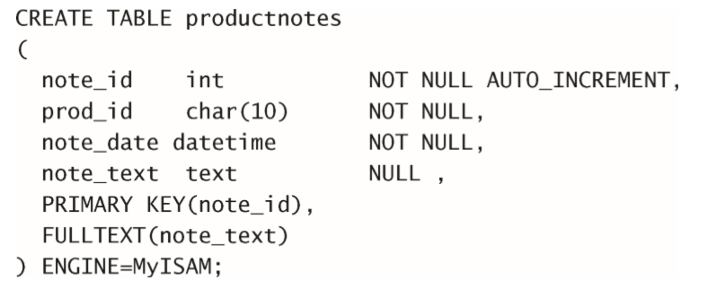
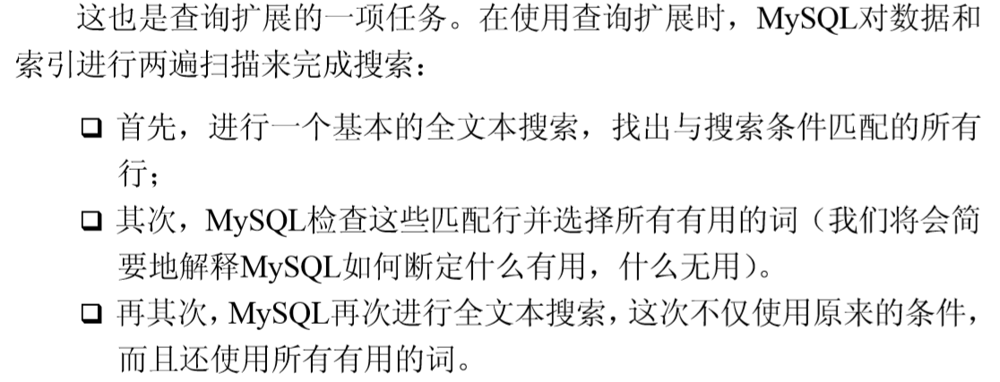
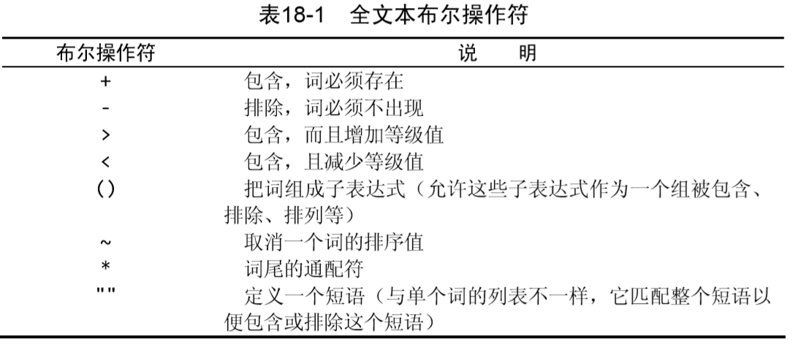
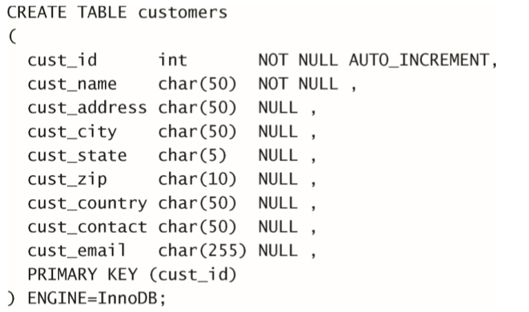
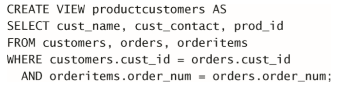
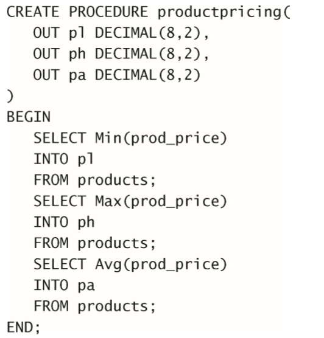
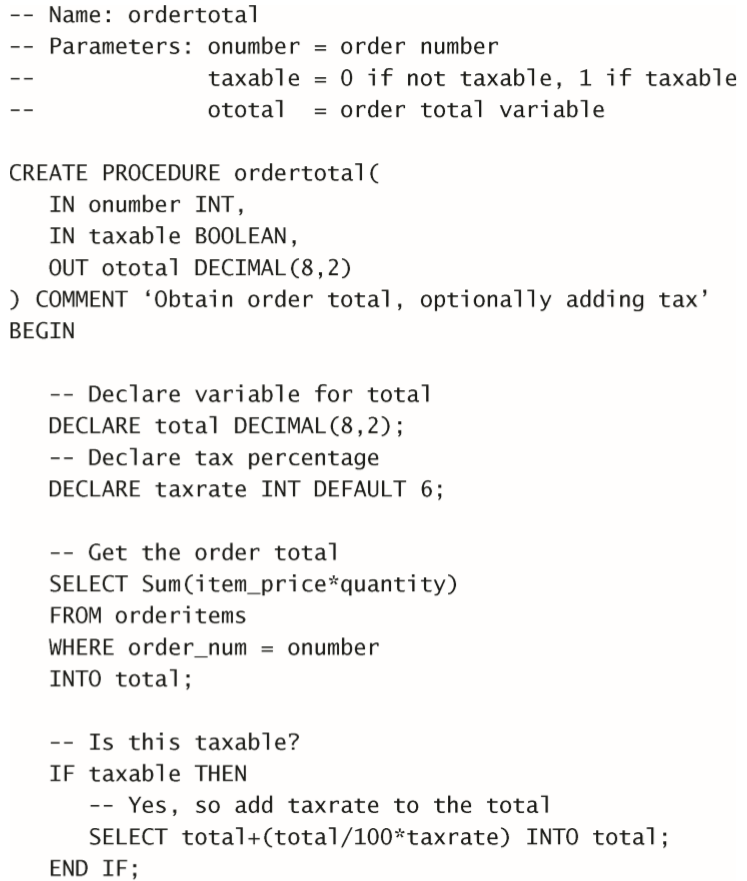
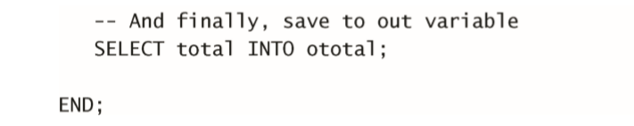
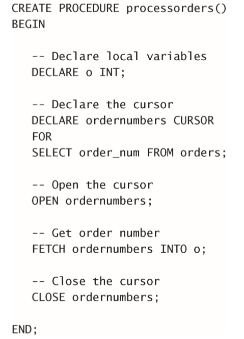
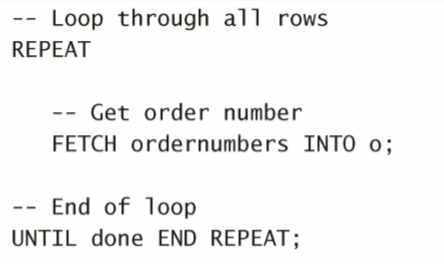

## 2. MySQL简介
### 2.1 什么是MySQL
> * MySQL是一种DBMS，即它是一种数据库软件。 
> * —MySQL是开放源代码的，一般可以免费使用
> * MySQL执行很快

## 3. 使用MySQL
### 3.2 选择数据库
> `USE xxxx`选择某一个数据库
### 3.3 了解数据库
> `SHOW DATABASES`:返回数据库可用的一个表.
> `SHOW TABLES`:获得(当前选中)数据库内的表的列表.
> `SHOW`也可以显示表列.如`SHOW COLUMS FROM xxx`
> `自动增量`:某些表需要唯一值.如订单编号,ID的,*当添加每一行时,MySQL可以自动为每个行分配下一个可用编号*,如果需要则需要在CREATE时添加某些固定部分.
> `SHOW STATUS`:显示服务器状态信息
> `SHOW CREATE DATABASES`和`SHOW CREATE TABLE`,显示创建特定数据库或表.
> `SHOW GRANTS`显示用户的安全权限
> `SHOW ERRORS`和`SHOW WARNINGS`显示错误和警告信息.

## 4. 检索数据
`SELECT colname FROM table`,检索一个名为`colname`的列,从`table`中.

**使用分号来表示命令结束.**
`SELECT colname,xxy FROM table`:**检索多个列.**
`SELECT * FROM table`**使用通配符**.所有的列.
 
**检索不同的行**
`SELECT DISTINCT colname FROM table`检索不同的行.(即colname中只有不同的数据才会被返回.)
**不能部分使用`DISTINCT`**

**限制结果**
`SELECT colname FROM table LIMIT 5`:返回不多于5行.
`SELECT colname FROM table LIMIT 5,5`:第一个5表示从第五行开始,第二个5表示最多5行.**行号为0开始**

**使用完全限定的表名**
`SELECT table.colname FROM table`
`SELECT table.colname FROM database.table`

## 5. 数据检索排序
`SELECT colname FROM table ORDER BY colname`:*可以选择非选择的列进行排序*即`SELECT`没出现的`colname`进行排序

**多个列排序**
`SELECT colname1,colname2,colname3 FROM table ORDER BY colname1,colname3`

**指定排序方向**
`SELECT colname1,colname2,colname3 FROM table ORDER BY colname1 DESC`**DESC关键字只应用到直接位于其前面的列名。**
例如:`SELECT colname1,colname2,colname3 FROM table ORDER BY colname1 DESC, colname2`:即如果多个指定顺序需要在多个后面指定`DESC`,**ASC通常不使用,因为默认是升序的**

**使用`ORDER`和`LIMIT`能选出最大值和最小值**
`SELECT price FROM table ORDER BY price DESC LIMIT 1;`

## 6. 过滤数据
`WHERE`词在表名之后给出,即在`FROM`之后给出.
`SELECT colname1,colname2 FROM table WHERE colname2 = 30;`:返回`colname2 = 30`的记录

**WHERE子句的位置  在同时使用ORDER BY和WHERE子句时，应 该让ORDER BY位于WHERE之后，否则将会产生错误**

**英文字母默认不区分大小写**字符串限定需要加引号,值比较不需要.例如:`WHERE colname1 = 'xxx'`和`WHERE colname2 = 3`;

**范围值检查**
`SELECT colname1, colname2 FROM table WHERE colname2 BETWEEN 5 AND 10;`

**空值检查**
`SELECT colname1 FROM table WHERE colname2 IS NULL;`

## 7. 组合过滤
**`AND`操作符**
`SELECT colname1, colname2, colname3 FROM table WHERE colname1 = 10 AND colname2 <=49;`
**`OR`操作符**

**`WHERE`可以包含任意次`AND`和`OR`**
但是`AND`优先级高于`OR`可能导致非预期的结果.
`SELECT name, price FROM table WHERE id = 100 OR id = 101 AND price >= 10;`事实结果为:`id = 100 OR (id = 101 AND price >= 10)`
因此需要用括号进行精准限定.

**`IN`操作符**
`SELECT name, price FROM table WHERE id IN (100, 110) AND price >= 10;`**清单必须在`IN`之后的圆括号中**
**优势**:
>* 在使用长的合法选项清单时，IN操作符的语法更清楚且更直观. 
>* 在使用IN时，计算的次序更容易管理（因为使用的操作符更少）。
>* IN操作符一般比OR操作符清单执行更快。 
>* IN的最大优点是可以包含其他SELECT语句，使得能够更动态地建立WHERE子句

**`NOT`操作符**
**否定之后跟条件的关键字.**
`SELECT name, price FROM table WHERE id NOT IN (100, 110) AND price >= 10;`表明要选择不在`100`和`110`中.

## 8. 通配符
**百分号通配符**
`%`表示任何字符出现任意次.
`SELECT name1, name2 FROM table WHERE name2 LIKE 'Jet%';`查询`name2`为任意`jet`开头的行
**通配符可以同时出现在多处**,但 **`%`不能统配NULL**

**下划线`_`**
**匹配单个任意字符**
`SELECT name1, name2 FROM table WHERE name2 LIKE '_ Jet%';`

## 9. 正则表达式
MySQL仅支持正则表达式中的很小一个子集.
`SELECT name1 FROM table WHERE name1 `
**基本字符匹配**
`SELECT colname1 FROM table WHERE name2 REGEXP '1000'`:在第八章的上述通配符中,将`LIKE`变为`REGEXP`;
`.`字符表示*匹配任意一个字符*
`REGEXP`和`LIKE`不同,，LIKE匹配整个列。如果被匹配的文本在列值中出现，LIKE将不会找到它，相应的行也不被返回(除非使用通配符)。而REGEXP在列值内进行匹配，如果被匹配的文本在列值中出现，REGEXP将会找到它，相应的行将被返回。这是一个非常重要的差别
**正则表达式匹配不区分大小写**
**`OR`匹配**
`SELECT colname1 FROM table WHERE name2 REGEXP '1000|2000'`
**匹配几个字符之一**
用`[]`括号来完成:`SELECT colname1 FROM table WHERE name2 REGEXP '[123]TOM'`,表示TOM前面`123`中的任意一个出现一次即匹配.
也可以变为`'[1|2|3]TOM'`,跟上述的是相通的,但是如果变为`'1|2|3 TOM'`则变为`1`或`2`或`3 TOM`;
**否定匹配字符**
`[^123]`表示匹配除了`1,2,3`之外的字符
**范围匹配**
`[1-9],[a-z],[3-6]`都合法.
**特殊字符的查找**
利用前缀`\\`例如`\\.`表示查找和`.`匹配的.,
**空白元字符**
`\\f`:换页;`\\n`:换行;`\\r`:回车;`\\t`:制表;`\\v`:纵向制表;
**匹配字符类**
`[:alnum:]`:任意**字母和数字**;&emsp;&emsp;`[:alpha:]`:任意字符,`a-z,A-Z`;&emsp;&emsp;`[:blank:]`:空格和制表;&emsp;&emsp;`[:cntrl:]`:`ASCII`控制字符,`ASCII 0-31和127`;&emsp;&emsp;`[:print:]`:任意可打印字符;&emsp;&emsp;`[:graph:]`:和`print`相同,少了空格;&emsp;&emsp;`[:lower:]`:任意小写字母;&emsp;&emsp;`[:punct:]`:既不在`[:alnum:]`也不在`[:cntrl:]`中的任意字符;&emsp;&emsp;`[:space:]`:包括空格在内的任意空白字符;*同`[\\f\\n\\r\\t\\v]`;&emsp;&emsp;`[:upper:]`:任意大写字符;&emsp;&emsp;`[:xdigit:]`:任意十六进制数字同`[0-9a-fA-F]`;
**重复元字符**

**定位元字符**

> `^`的两种用法.在集合中`[]`,用来否定该集合.否则用来指串的开始处.
## 10. 创建计算字段
### 10.1 计算字段的需要
**原因**
> 需要从数据库中检索出**转换、计算或格式化过**的数据
> **计算字段是不在数据库表中,而是在运行时`SELECT`语句中创建的.**

*字段的概念*:基本上与列的概念相同.通常称数据库列为列.
### 10.2 拼接字段
假如`table`表有`name1`,`name2`两个列.假如要生成一个报表.需要在`name1`中按照`name1(name2)`的格式进行生成.
**拼接**将值连到一起,构成单个值,相当于构建了`name3`就等于`name1(name2)`
**使用方法**:Contact()函数;
> ***多数DBMS使用`+`或者`||`来实现拼接.而MySQL使用`Contact()`***

**例子**
`SELECT Contact(name1, '(', name2, ')') FROM table ORDER BY name1;`
接收一个或多个参数.
**删除值最右边的空格**
`RTrim()`,当然还有`LTrim`和`Trim`.分别为去掉左边和两边的空格
**使用别名**
输出的新列,实际上**没有名字**为了能够引用,采用别名
`SELECT Contact(name1, '(', name2, ')') AS newname FROM table ORDER BY name1;`

### 10.3执行算术计算.
例如订单表中有单价和售出数量,但是没有售出总价,可以用
`SELECT prod_id, quantity, item_price, quantity*item_price AS expended_price FROM table ORDER BY prod_id;`
暂时支持`+,-,*,/`四种运算,圆括号可以用来提高优先级.

## 11. 使用数据处理函数
### 11.1 通常不太可移植
但是为了效率,还是会留着,在使用的时候建议用上注释.
### 11.2 
大多数`SQL`支持的函数:
> 1. 处理文本串的函数(大小写转换,删除,填充,转换为值)
> 2. 数值操作函数.
> 3. 处理日期和时间.并从值中获取特定成分(例如日期之差,日期有效性等)的时间和日期函数.
> 4. 返回DBMS正使用的特殊信息(用户登录信息.检查版本等)函数.

### 11.3 文本串函数


`SOUNDEX`表示将任何文 本串转换为描述其语音表示的字母数字模式的算法。(类似于输入的时候输入错误比如`Lie`输出成了`Lee`,直接用`Lie`搜肯定搜不到.)

### 11.4 时间处理函数

**日期格式:**yyyy-mm-dd
**one trick** 找2005年8月的记录:
`SELECT name1, name2 FROM table WHERE Date(order_data) BETWEEN '2005-08-01' AND '2005-08-31';`
优化版:
`SELECT name1, name2 FROM table WHERE Year(order_date) = 2005 AND Month(order_date) = 8;`
### 11.5 数值处理函数


## 12 汇总数据.
**为什么要汇总数据**
> 有的时候我们并不在乎某一条具体的数据,只需要获得这些的汇总数据,典型的例子如:
> 1. 确定表中的行数
> 2. 获得行组的和
> 3. 找出表列的最大值最小值,中位数平均值
### 聚集函数

例如`SELECT AVG(name1) AS newname FROM table;`
> 1. `AVG`只用于单个列.若要对多个列取平均值则需要多个`AVG`
> 2. `COUNT`,参数为\*则对表中的数据进行计数,无论`NULL`或非空值.例如`SELECT COUNT(*) AS num_cust FROM table;`对行进行计数,不论各列中有什么值.再又如`SELECT COUNT(colname) AS num_cust FROM table;`表示对`colnam`e中有值的行进行计数.
> 3. `MAX`返回最大值.须用列名作为参数.
> 4. `MIN`和`MAX`都类似.
### 聚集不同值(意思就是相同的值只考虑一遍)
例如`AVG(DISTINCT name1)`默认的是`ALL`参数.**注意加了DISTINCT必须加列名**
### 聚集函数可以被组合
即相当于`SELECT name1, name2`中`name1`和`name2`被采用了聚集函数.

## 13. 分组数据
分组能够把数据**分成**多个组,每个组进行不同的操作如上一章说的聚集计算
### 13.1 创建分组
在`SELECT`语句中的`GROUP BY`建立,
例如:`SELECT name1, COUNT(*) AS num_name1 FROM table GROUP BY name1;`
> 这里的逻辑,原本的`SELECT`是对table中的所有数据当做一组内容进行操作.在使用了`GROUP BY`之后,相当于`name1`中进行分组排序,然后对`name1`中的每一组进行`SELECT`后的操作.
> * `GROUP BY`可以包含任意数量的列.即分组嵌套.提供细致的数据分组.
> * 如果在`GROUP BY`子句中嵌套了分组，数据将在后规定的分组上进行汇总。换句话说，在建立分组时，指定的所有列都一起计算（所以不能从个别的列取回数据）。 
> * `GROUP BY`子句中列出的每个列都必须是检索列或有效的表达式 （但不能是聚集函数）。如果在SELECT中使用表达式，则必须在 `GROUP BY`子句中指定相同的表达式,不能使用别名。 
> * 除聚集计算语句外，`SELECT`语句中的每个列都必须在`GROUP BY`子 句中给出
> * 如果分组列中具有`NULL`值，则`NULL`将作为一个分组返回。如果列 中有多行`NULL`值，它们将分为一组。 
> * `GROUP B`Y子句必须出现在WHERE子句之后，`ORDER BY`子句之前
### 13.2 过滤分组
**注意这里过滤的是分组**,`WHERE`过滤的是行
例子:`SELECT name, COUNT(*) AS num_name1 FROM table GROUP BY name1 HAVING COUNT(*) >= 2;`
### 13.3 SELECT子句顺序


## 14. 子查询
***嵌套在其他查询里面的查询***
相当于联合查询.即使用了之前的查询结果.

### 14.1利用子查询进行过滤
比如说想要查询:买了A物品的人的名字叫什么
* 首先查询有A物品的订单的订单号
* 然后根据所得的订单号查询对应的人名

`SELECT order_num FROM orders WHERE item = 'A';`,比如说查询的结果为:

ordername|
--|:--
10001|
10005|
则根据订单号`10001`和`10005`查询对应的人名(订单编号和人名对应)
`SELECT name FROM names WHERE order_num IN (10001,10005);`
则可以进行嵌套:
`SELECT name FROM names WHERE order_num IN (SELECT order_num FROM orders WHERE item = 'A');`
**理论上可以无线嵌套,但是性能上来说,次数不要太多为好**

### 14.2 作为计算字段使用子查询
> 假设需要显示`customer`表中,每个客户的订单总数,订单与相应的客户`ID`存储在`order`s表中.
> * 从`customer`表中检索客户列表
> * 对于检索出的客户,统计其在`orders`表中的订单数目.
```MySQL
SELECT cust_name,
       cust_state,
       (SELECT COUNT(*)
       FROM orders
       WHERE orders.cust_id = customers.cust_id) AS orders
FROM customers
ORDER BY cust_name;
```
带点的为完全限定名,排除可能的多义性,而**这种涉及外部查询的子查询叫做相关子查询**

## 15 联结表
最强大功能之一:**在数据检索查询的执行中联结表**

### 15.1 关系表
减少相同的数据出现的次数.**通过某些常用的值互相关联**的多个表叫做关系表.
**外键的概念:** 外键是某个表中的一列,包含了另一个表的 **主键值**
```
SELECT vend_name, prod_name, prod_price
FROM vendors, products 
WHERE vendors.vend_id = products.vend_id
ORDER BY vend_name, prod_name;
```
这里`vendors`只包含了供应商的信息,而`products`只包含了产品的信息和对应的供应商的信息.
现在来看`FROM`子句。与以前的`SELECT`语句不一样，这条语句的`FROM`子句列出了两个表，分别是`vendors`和`products`。它们就是这条`SELECT`语句联结的两个表的名字。这两个表用`WHERE`子句正确联结，`WHERE`子句指示`MySQL`匹配`vendors`表中的`vend_id`和`products`表中的`vend_id`。 
**应该保证所有联结都有WHERE子句**
### 15.2 内部联结
**基于两个表之间的相等测试**,对于如下语句跟`15.1`中返回的结果完全相同:
```
SELECT vend_name, prod_name, prod_price
FROM vendors INNER JOIN products 
ON vendors.vend_id = products.vend_id;
```

### 15.3 联结多个表
**列出所有的表,在`WHERE`中定义表之间的关系**
利用联结改写14章中自己举的例子:*买了A物品的人的名字叫什么*
```
SELECT name 
FROM names, orders 
WHERE orders.order_num = names.order_num
ORDER BY name;
```
将子查询变换成了联结.

## 16. 创建高级联结
主要是介绍其他类型的联结(跟15章中的内部联结不同),然后如何对被联结的表使用**表别名**和**聚集函数**
给表名取别名的原因:
* 缩短语句
* 允许在单条`SELECT`语句中多次使用相同的表.

### 16.1 自联结
假如你发现某物品(其ID为DTNTR)存在问题，因此想知道生产该物品的供应商生产的其他物品是否也存在这些问题.此查询要求首先找到生产ID为DTNTR的物品的供应商,然后找出这个供应商生产的其他物品.下面是解决此问题的一种方法：
```
SELECT prod_id, prod_name
FROM products 
WHERE vend_id = (SELECT ven_id
                 FROM products 
                 WHERE prod_id = 'DTNTR');
```
使用自联结:
```
SELECT p1.prod_id, p1.prod_name
FROM products AS p1, products AS p2
WHERE p1.vend_id = p2.vend_id
    AND p2.prod_id = 'DTNTR';
```
自联结的意思就是自己跟自己联结呗.
### 16.2 自然联结
对表进行联结的条件:**需要只要一个列出现在不止一个表中**,才能进行联结.也很好理解.
标准联结返回所有数据,甚至相同的列出现多次,**自然联结**排除多次出现.
### 16.3 外部联结
联结的本质:**一个表中的某一行和另一个表中的某一行关联**
外部联结是**需要包含没有关联的那些行**例如:
* 对每个客户下的订单数量进行计数.包括那些还未下订单的.
```
SELECT customers.cust_id, orders.cust_id
FROM customers LEFT OUTER JOIN orders
 ON customers.cust_id = orders.cust_id; 
```
关键词:**`LEFT OUTER JOIN`**
在使用`OUTER JOIN`语法时，必须使用`RIGHT`或`LEFT`关键字指定包括其所有行的表（`RIGHT`指出的是`OUTER JOIN`右边的表，而`LEFT`指出的是`OUTER JOIN`左边的表）。上面的例子使用`LEFT OUTER JOIN`从`FROM`子句的左边表（`customers`表）中选择所有行。为了从右边的表中选择所有行，应该使用`RIGHT OUTER JOIN`
### 16.4 带聚集函数的联结
```
SELECT customers.cust_name,
       customers.cust_id,
       COUNT(orders.ordernum) AS num_ord
FROM customers INNER JOIN orders
 ON customers.cust_id = orders.cust_id
GROUP BY customers.cust_id;
```
***
## 17. 组合查询
之前一条语句就用了一个`SELECT`,但是也支持使用多个`SELECT`,通过在多条`SELECT`语句中添加`UNION`关键字;
例如:在数据库中查找名字叫做`A`或者年级大于`20`的人:
`SELECT name, age FROM table WHERE name = 'A';`
`SELECT name, age FROM table WHERE age > 20;`
使用`UNION`进行联合:
```
SELECT name, age FROM table WHERE name = 'A'
UNION
SELECT name, age FROM table WHERE age > 20
```
**需要注意的点:**
* `UNION`前后的`SELECT`都必须有相同的列(数量,和名称),列顺序不做要求,
* `UNION`达到的效果,通常可以在`WHERE`中添加多个`OR`达到.
* 第一条所说的列,也可以是表达式或者是聚集函数(但是都需要保证**相同**)
* 列数据必须兼容:(相同或者`DBMS`可以隐式转换)

### 包含或取消重复的行
怎么理解:上一点如果名字为`A`的人刚好也大于`20`岁,则`UNION`前后的结果中都会包含`A`这条记录.
`UNION`默认删除重复行.如果不想删除则使用`UNION ALL`;
### 对UNION结果排序
只能在最后的一个`SELECT`后跟`ORDER BY`

## 18. 全文本搜索
**`MyISAM`支持全文本搜索,而`InnoDB`不支持**
通过`LIKE`也可以进行全文搜索例如 `LIKE '%rabbit%'`,但是
* 这种为**非索引**搜索,需要对所有行进行匹配测试
### 启用全文搜索:
> 通常在创建表的时候`CREATE TABLE`接收`FULLTEXT`子句:

> * 根据`FULLTEXT`指示对包含的列进行索引
> * 可以包含多个列.
> * MySQL自动维护更新该索引.
> * 可以在创建表时指定`FULLTEXT`也可以稍后指定.
### 进行全文本搜索.
使用:`Match(), Against()`进行全文本搜索.
>* `Match()`指定被搜索的列
>* `Against()`指定要搜索的表达式.
实例:`SELECT note_text FROM productnotes WHERE Match(note_text) Against('rabbit');`
>* 传递给`Match()`的值必须跟`FULLTEXT`中定义的相同,如果使用多个列,则顺序必须相同.
>* 搜索不区分大小写

**使用`Match(), Against()`有匹配的等级,返回的结果按照匹配的等级进行排序**
```
SELECT note_text 
       Match(note_text) Against('rabbit') AS rank
FROM productnotes;
```
### 使用查询扩展
**放宽返回的全文本搜索的范围**类似于模糊查询,但又不太像

例如使用查询扩展:
```
SELECT note_text 
FROM productnotes
WHERE Match(note_text) Against('rabbit' WITH QUERY EXPANSION);
```
> 假设返回了三行,仅有一行包含`rabbit`,第二行和第三行则出现了第一行中出现的其他词,不过匹配度不同.
> * 查询的结果跟表中的行有有关:**行越多,查询结果越好**
### 布尔文本搜索
指定的方式:
> * 要匹配的词
>* 要排斥的词
>* 排列提示(如指定某些词的重要度)
>* 表达式分组
>* 等.

* 没有索引也可以执行,但是速度十分缓慢
例子:
```
SELECT note_text
FROM productnotes
WHERE Match(note_text) Against('rabbit -rope*' IN BOOLEAN MODE);
```

使用注意点:
* 在布尔方式中，不按等级值降序排序返回的行。 
* 在索引全文本数据时，短词被忽略且从索引中排除。短词定义为 那些具有3个或3个以下字符的词（如果需要，这个数目可以更改）。
* MySQL带有一个内建的非用词（stopword）列表，这些词在索引全文本数据时总是被忽略。如果需要，可以覆盖这个列表（请参 阅MySQL文档以了解如何完成此工作）。 
* 许多词出现的频率很高，搜索它们没有用处（返回太多的结果）。 因此，MySQL规定了一条50%规则，如果一个词出现在50%以上 的行中，则将它作为一个非用词忽略。50%规则不用于IN BOOLEAN MODE。
*  如果表中的行数少于3行，则全文本搜索不返回结果（因为每个词 或者不出现，或者至少出现在50%的行中）。 
* 忽略词中的单引号。例如，don't索引为dont
* 不具有词分隔符（包括日语和汉语）的语言不能恰当地返回全文 本搜索结果
## 19. 插入数据
**使用`INSERT`语句进行插入**
* 插入完整的行
* 插入部分的行
* 插入多行
* 插入某些查询的结果
### 插入完整的行
`INSERT INTO table
VALUES(
    'value1',
    'value2',
    'value3',
    NULL,
);`
* 各个列必须以他们在表中定义的顺序出现.

安全方法:
```
INSERT INTO table(
    colname1,
    colname2,
    colname3,
    colname4,
    colname5)
VALUES(
    value1,
    value2,
    value3,
    value4,
    value5);
```
* 列名的顺序可以交换,只要值对应即可
### 插入多个行
* 多个`INSERT`语句,以分号间隔,一次提交
* 多个`VALUE`的括号,中间以`,`分割,
### 插入检索出的数据
*将`SELECT`结果`INSERT`进表中*
例子:
```
INSERT INTO table(colname1,
    colname2,
    colname3,
    colname4)
SELECT colname1,
    colname2,
    colname3,
    colname4
FROM table2;
```
> 为简单起见，这个例子在INSERT和 SELECT语句中使用了相同的列名。但是，不一定要求列名匹配。 事实上，MySQL甚至不关心SELECT返回的列名。它使用的是 列的位置，因此SELECT中的第一列（不管其列名）将用来填充 表列中指定的第一个列，第二列将用来填充表列中指定的第二 个列，如此等等。这对于从使用不同列名的表中导入数据是非 常有用的。
* `SELECT`语句中可以包含过滤语句
## 20. 更新和删除数据
**`UPDATE`和`DELETE`**
### 更新数据
* 更新特定**行**
* 更新所有行

组成部分:
* 要更新的表
* 列名和他们的新值
* 确定要更新行的过滤条件.

例如更新某个人的邮件地址:
`UPDATE table SET colname = 'value' WHERE name = 'A';`
* `SET`后可以跟多个行和要更新的值**列-值**对
* `IGNORE`关键字,如果发生错误时,更新操作会被取消,而当不期望这些操作被取消时,在`UPDATE`后添加`IGNORE`关键词即可.
* 没有办法删除某一行中的某一列值,顶多只有将其设置为`NULL`
### 删除数据
* 删除特定行
* 删除所有行
`DELETE FROM table WHERE p`,跟`UPDATE`相比多了`FROM`,
> * 并不删除表本身.

如果想要将数据全部删除,可以使用:
`TRUECATE TABLE`,是删除原表然后建立一个同名新表.
## 21. 创建和操纵表
### CREATE TABLE
需要给出的信息:
* 新表的名字
* 表中列的定义和定义


关键字 `IF NOT EXISTS`加在表名后,检查是否已有表名.当不存在该表名时创建.
* `NULL`代表无值或缺值.
* **主键必须唯一**
* 主键值可以多列,在`PRIMARY KEY`中用逗号分隔开即可.
### AUTO_INCREMENT
自增
### 指定默认值:
在创建表时,例如指定某一列:
`colnamex type NULL/NOT NULL DEFAULT 3,`
### 引擎类型:
在创建表的列表项结尾处添加:`ENGINE=InnoDB`,
* `InnoDB`:事务性引擎,不支持全文本搜索
* `MEMORY`等同于`MyISAM`但是存储在内存中,速度很快(适用于临时表)
* `MyISAM`性能高,支持全文本搜索,不支持事务处理.

**外键不能跨引擎**
### 更新(改)表
使用`ALERT TABLE`语句.
* `ALERT TABLE`后给出要更改的表名,必须已存在
* 所做出的更改
例如:`ALERT TABLE table ADD colname CHAR(20);`,`ALERT TABLE table DROP COLUMN colname;`
### 删除表
**`DROP TABLE`**`tablename`
### 重命名表
**`RENAME TABLE oldname TO newname;`**
可以对多个表进行重命名,新旧名字对用逗号隔开.
## 22. 使用视图
视图类似于表,
### 规则和限制
* 唯一命名
* 需要权限创建视图
* 视图可以嵌套
* 视图不能索引,也不能有关联的触发器或默认值
### 使用视图
* 使用`CREATE VIEW`进行创建
* 使用`SHOW CREATE VIEW viewname`进行查看
* 使用`DROP VIEW viewname`删除视图
* 更新视图,先`DROP`再`CREATE`或者直接用`CREATE OR REPLACE VIEW`

**利用视图简化复杂的联结**

*相当于复用,创建别名.*
**用视图重新格式化检索出的数**
即,在`SELECT`中有一些需要改变格式的东西也可以存为视图
**用视图进行过滤**
相当于有过滤语句即`WHERE`的子句创建视图
**使用视图和计算字段**
### 更新视图
基本上不太用于更新,通常只用于查询
## 23. 使用存储过程
**概念**什么是存储过程:**为以后的使用而保存的一条或多条MySQL语句的集合**
*相当于一个封装的概念,或者是一个函数的概念,你只需要调用过程,传特定参数即可*
例子:
```
CALL processname(@para1,
                  @para2,
                  @para3);
```
### 创建存储过程
```
CREATE PROCEDURE productpricing()
BEGIN
    SELECT Avg(prod_price) AS priceaverage
    FROM products;
END;
```
需要的参数将会在括号中写进去(如果需要参数的话)
### 删除存储过程
`DROP PROCEDURE procedurename;`存在该过程则删除,不存在则报错.       
### 使用参数

关键字`OUT`指出相应的参数用来从存储过程传出一个值(返回给调用者)`MySQL`支持`IN`（传递给存储过程）、`OUT`（从存储过程传出，如这里所用）和`INOUT`（对存储过程传入和传出）类型的参数.
使用:
```
CALL productpricing(@pricelow,
                    @pricehigh,
                    @priceaverage);
```
这条语句不返回结果,`@`标志表示为变量,而不是列名啥的
如果要显示返回的结果的话:
`SELECT @pricelow;`或者`SELECT @pricelow, @pricehigh, @priceaverage;`
### 只能存储过程
考虑这个场景。你需要获得与以前一样的订单合计，但需要对合计 增加营业税，不过只针对某些顾客（或许是你所在州中那些顾客）。那么， 你需要做下面几件事情： 
* 获得合计（与以前一样）； 
* 把营业税有条件地添加到合计；
* 返回合计（带或不带税）。



> `--`为注释,`DECLARE`定了两个局部变量,(好像没有定义全局变量的需要,因为全局变量就是传入的参数.),`COMMENT`关键字如果给出,其结果在`SHOW PROCEDURE STATUS`中显示.
### 检查存储过程
`SHOW CREATE PROCEDURE procedurename;`,比较搞不清楚为什么要加`CREATE`;
为了获得包括何时、由谁创建等详细信息的存储过程列表，使用`SHOW PROCEDURE STATUS。`
## 24. 游标
**游标:** 需要在检索出来的行中前进或后退一行或多行。这就是使用游标的原因。
使用游标四个步骤:
* 创建游标
* 打开游标
* 对于填有数据的游标,根据需要取出各行
* 结束游标使用时,关闭游标
### 创建游标
```
CREATE PROCEDURE processorders()
BEGIN 
    DECLARE ordernumbers CURSOR
    FOR
    SELECT order_num FROM orders;
END;
```
### 打开和关闭游标
`OPEN ordernumbers;`
`CLOSE ordernumbers;`
### 使用游标
***FETCH***

循环使用:

上述代码夹杂在`OPEN`和`CLOSE`语句中间
