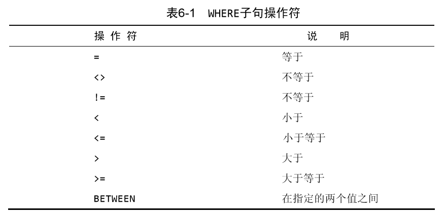
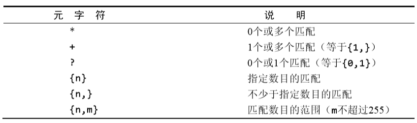
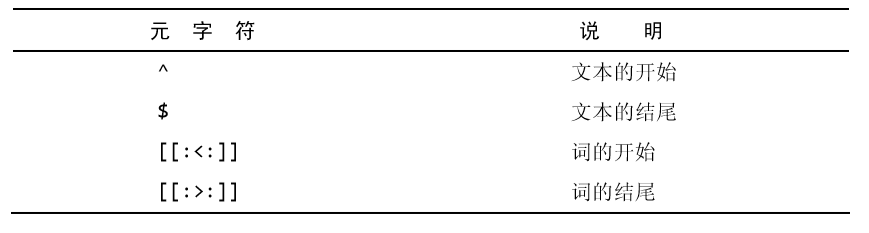
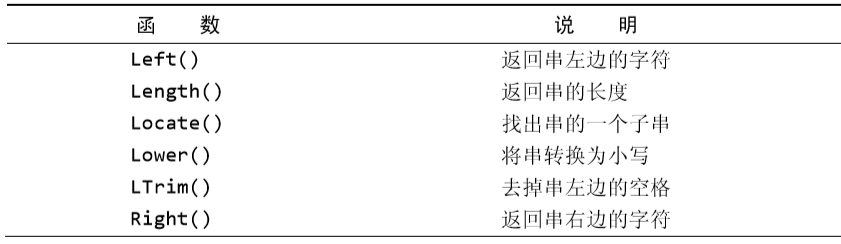
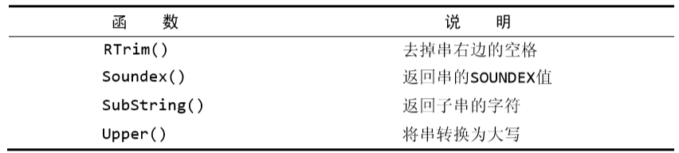
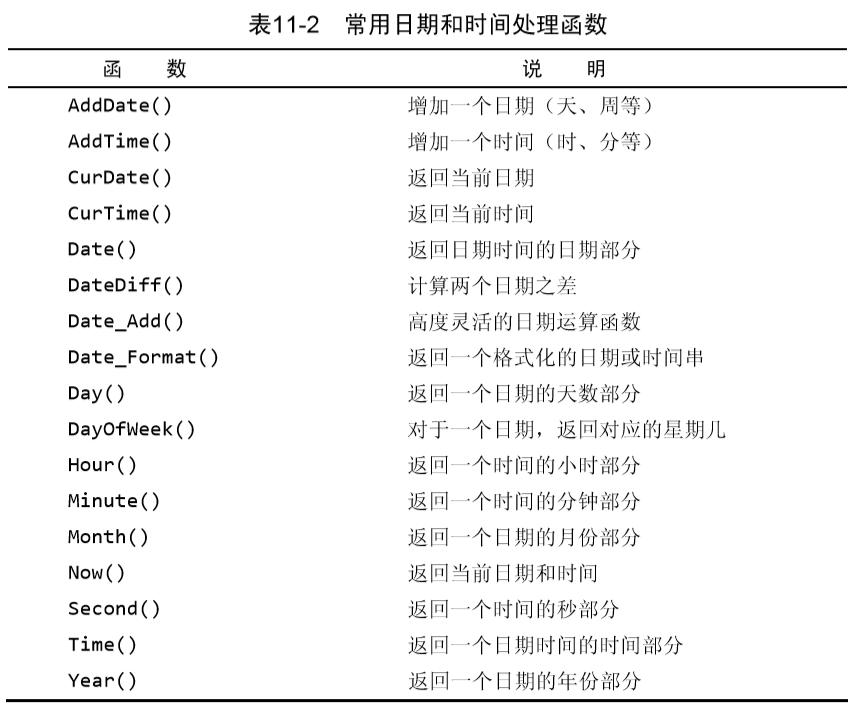
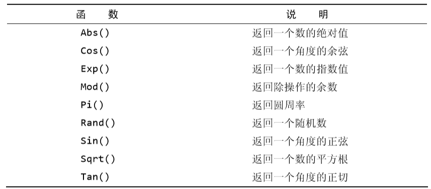
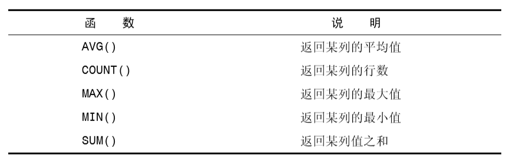
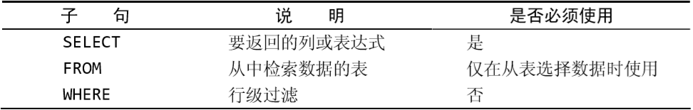
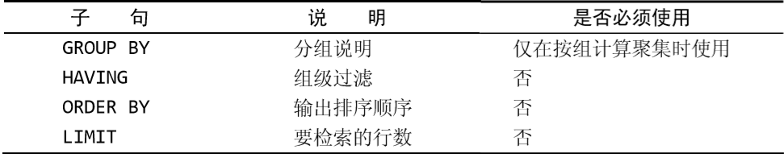

## 2. MySQL简介
### 2.1 什么是MySQL
> * MySQL是一种DBMS，即它是一种数据库软件。 
> * —MySQL是开放源代码的，一般可以免费使用
> * MySQL执行很快

## 3. 使用MySQL
### 3.2 选择数据库
> `USE xxxx`选择某一个数据库
### 3.3 了解数据库
> `SHOW DATABASES`:返回数据库可用的一个表.
> `SHOW TABLES`:获得(当前选中)数据库内的表的列表.
> `SHOW`也可以显示表列.如`SHOW COLUMS FROM xxx`
> `自动增量`:某些表需要唯一值.如订单编号,ID的,*当添加每一行时,MySQL可以自动为每个行分配下一个可用编号*,如果需要则需要在CREATE时添加某些固定部分.
> `SHOW STATUS`:显示服务器状态信息
> `SHOW CREATE DATABASES`和`SHOW CREATE TABLE`,显示创建特定数据库或表.
> `SHOW GRANTS`显示用户的安全权限
> `SHOW ERRORS`和`SHOW WARNINGS`显示错误和警告信息.

## 4. 检索数据
`SELECT colname FROM table`,检索一个名为`colname`的列,从`table`中.

**使用分号来表示命令结束.**
`SELECT colname,xxy FROM table`:**检索多个列.**
`SELECT * FROM table`**使用通配符**.所有的列.
 
**检索不同的行**
`SELECT DISTINCT colname FROM table`检索不同的行.(即colname中只有不同的数据才会被返回.)
**不能部分使用`DISTINCT`**

**限制结果**
`SELECT colname FROM table LIMIT 5`:返回不多于5行.
`SELECT colname FROM table LIMIT 5,5`:第一个5表示从第五行开始,第二个5表示最多5行.**行号为0开始**

**使用完全限定的表名**
`SELECT table.colname FROM table`
`SELECT table.colname FROM database.table`

## 5. 数据检索排序
`SELECT colname FROM table ORDER BY colname`:*可以选择非选择的列进行排序*即`SELECT`没出现的`colname`进行排序

**多个列排序**
`SELECT colname1,colname2,colname3 FROM table ORDER BY colname1,colname3`

**指定排序方向**
`SELECT colname1,colname2,colname3 FROM table ORDER BY colname1 DESC`**DESC关键字只应用到直接位于其前面的列名。**
例如:`SELECT colname1,colname2,colname3 FROM table ORDER BY colname1 DESC, colname2`:即如果多个指定顺序需要在多个后面指定`DESC`,**ASC通常不使用,因为默认是升序的**

**使用`ORDER`和`LIMIT`能选出最大值和最小值**
`SELECT price FROM table ORDER BY price DESC LIMIT 1;`

## 6. 过滤数据
`WHERE`词在表名之后给出,即在`FROM`之后给出.
`SELECT colname1,colname2 FROM table WHERE colname2 = 30;`:返回`colname2 = 30`的记录

**WHERE子句的位置  在同时使用ORDER BY和WHERE子句时，应 该让ORDER BY位于WHERE之后，否则将会产生错误**

**英文字母默认不区分大小写**字符串限定需要加引号,值比较不需要.例如:`WHERE colname1 = 'xxx'`和`WHERE colname2 = 3`;

**范围值检查**
`SELECT colname1, colname2 FROM table WHERE colname2 BETWEEN 5 AND 10;`

**空值检查**
`SELECT colname1 FROM table WHERE colname2 IS NULL;`

## 7. 组合过滤
**`AND`操作符**
`SELECT colname1, colname2, colname3 FROM table WHERE colname1 = 10 AND colname2 <=49;`
**`OR`操作符**

**`WHERE`可以包含任意次`AND`和`OR`**
但是`AND`优先级高于`OR`可能导致非预期的结果.
`SELECT name, price FROM table WHERE id = 100 OR id = 101 AND price >= 10;`事实结果为:`id = 100 OR (id = 101 AND price >= 10)`
因此需要用括号进行精准限定.

**`IN`操作符**
`SELECT name, price FROM table WHERE id IN (100, 110) AND price >= 10;`**清单必须在`IN`之后的圆括号中**
**优势**:
>* 在使用长的合法选项清单时，IN操作符的语法更清楚且更直观. 
>* 在使用IN时，计算的次序更容易管理（因为使用的操作符更少）。
>* IN操作符一般比OR操作符清单执行更快。 
>* IN的最大优点是可以包含其他SELECT语句，使得能够更动态地建立WHERE子句

**`NOT`操作符**
**否定之后跟条件的关键字.**
`SELECT name, price FROM table WHERE id NOT IN (100, 110) AND price >= 10;`表明要选择不在`100`和`110`中.

## 8. 通配符
**百分号通配符**
`%`表示任何字符出现任意次.
`SELECT name1, name2 FROM table WHERE name2 LIKE 'Jet%';`查询`name2`为任意`jet`开头的行
**通配符可以同时出现在多处**,但 **`%`不能统配NULL**

**下划线`_`**
**匹配单个任意字符**
`SELECT name1, name2 FROM table WHERE name2 LIKE '_ Jet%';`

## 9. 正则表达式
MySQL仅支持正则表达式中的很小一个子集.
`SELECT name1 FROM table WHERE name1 `
**基本字符匹配**
`SELECT colname1 FROM table WHERE name2 REGEXP '1000'`:在第八章的上述通配符中,将`LIKE`变为`REGEXP`;
`.`字符表示*匹配任意一个字符*
`REGEXP`和`LIKE`不同,，LIKE匹配整个列。如果被匹配的文本在列值中出现，LIKE将不会找到它，相应的行也不被返回(除非使用通配符)。而REGEXP在列值内进行匹配，如果被匹配的文本在列值中出现，REGEXP将会找到它，相应的行将被返回。这是一个非常重要的差别
**正则表达式匹配不区分大小写**
**`OR`匹配**
`SELECT colname1 FROM table WHERE name2 REGEXP '1000|2000'`
**匹配几个字符之一**
用`[]`括号来完成:`SELECT colname1 FROM table WHERE name2 REGEXP '[123]TOM'`,表示TOM前面`123`中的任意一个出现一次即匹配.
也可以变为`'[1|2|3]TOM'`,跟上述的是相通的,但是如果变为`'1|2|3 TOM'`则变为`1`或`2`或`3 TOM`;
**否定匹配字符**
`[^123]`表示匹配除了`1,2,3`之外的字符
**范围匹配**
`[1-9],[a-z],[3-6]`都合法.
**特殊字符的查找**
利用前缀`\\`例如`\\.`表示查找和`.`匹配的.,
**空白元字符**
`\\f`:换页;`\\n`:换行;`\\r`:回车;`\\t`:制表;`\\v`:纵向制表;
**匹配字符类**
`[:alnum:]`:任意**字母和数字**;&emsp;&emsp;`[:alpha:]`:任意字符,`a-z,A-Z`;&emsp;&emsp;`[:blank:]`:空格和制表;&emsp;&emsp;`[:cntrl:]`:`ASCII`控制字符,`ASCII 0-31和127`;&emsp;&emsp;`[:print:]`:任意可打印字符;&emsp;&emsp;`[:graph:]`:和`print`相同,少了空格;&emsp;&emsp;`[:lower:]`:任意小写字母;&emsp;&emsp;`[:punct:]`:既不在`[:alnum:]`也不在`[:cntrl:]`中的任意字符;&emsp;&emsp;`[:space:]`:包括空格在内的任意空白字符;*同`[\\f\\n\\r\\t\\v]`;&emsp;&emsp;`[:upper:]`:任意大写字符;&emsp;&emsp;`[:xdigit:]`:任意十六进制数字同`[0-9a-fA-F]`;
**重复元字符**

**定位元字符**

> `^`的两种用法.在集合中`[]`,用来否定该集合.否则用来指串的开始处.
## 10. 创建计算字段
### 10.1 计算字段的需要
**原因**
> 需要从数据库中检索出**转换、计算或格式化过**的数据
> **计算字段是不在数据库表中,而是在运行时`SELECT`语句中创建的.**

*字段的概念*:基本上与列的概念相同.通常称数据库列为列.
### 10.2 拼接字段
假如`table`表有`name1`,`name2`两个列.假如要生成一个报表.需要在`name1`中按照`name1(name2)`的格式进行生成.
**拼接**将值连到一起,构成单个值,相当于构建了`name3`就等于`name1(name2)`
**使用方法**:Contac()函数;
> ***多数DBMS使用`+`或者`||`来实现拼接.而MySQL使用`Contact()`***

**例子**
`SELECT Contact(name1, '(', name2, ')') FROM table ORDER BY name1;`
接收一个或多个参数.
**删除值最右边的空格**
`RTrim()`,当然还有`LTrim`和`Trim`.分别为去掉左边和两边的空格
**使用别名**
输出的新列,实际上**没有名字**为了能够引用,采用别名
`SELECT Contact(name1, '(', name2, ')') AS newname FROM table ORDER BY name1;`

### 10.3执行算术计算.
例如订单表中有单价和售出数量,但是没有售出总价,可以用
`SELECT prod_id, quantity, item_price, quantity*item_price AS expended_price FROM table ORDER BY prod_id;`
暂时支持`+,-,*,/`四种运算,圆括号可以用来提高优先级.

## 11. 使用数据处理函数
### 11.1 通常不太可移植
但是为了效率,还是会留着,在使用的时候建议用上注释.
### 11.2 
大多数`SQL`支持的函数:
> 1. 处理文本串的函数(大小写转换,删除,填充,转换为值)
> 2. 数值操作函数.
> 3. 处理日期和时间.并从值中获取特定成分(例如日期之差,日期有效性等)的时间和日期函数.
> 4. 返回DBMS正使用的特殊信息(用户登录信息.检查版本等)函数.

### 11.3 文本串函数

`SOUNDEX`表示将任何文 本串转换为描述其语音表示的字母数字模式的算法。(类似于输入的时候输入错误比如`Lie`输出成了`Lee`,直接用`Lie`搜肯定搜不到.)

### 11.4 时间处理函数

**日期格式:**yyyy-mm-dd
**one trick** 找2005年8月的记录:
`SELECT name1, name2 FROM table WHERE Date(order_data) BETWEEN '2005-08-01' AND '2005-08-31';`
优化版:
`SELECT name1, name2 FROM table WHERE Year(order_date) = 2005 AND Month(order_date) = 8;`
### 11.5 数值处理函数

## 12 汇总数据.
**为什么要汇总数据**
> 有的时候我们并不在乎某一条具体的数据,只需要获得这些的汇总数据,典型的例子如:
> 1. 确定表中的行数
> 2. 获得行组的和
> 3. 找出表列的最大值最小值,中位数平均值
### 聚集函数

例如`SELECT AVG(name1) AS newname FROM table;`
> 1. `AVG`只用于单个列.若要对多个列取平均值则需要多个`AVG`
> 2. `COUNT`,参数为\*则对表中的数据进行计数,无论`NULL`或非空值.例如`SELECT COUNT(*) AS num_cust FROM table;`对行进行计数,不论各列中有什么值.再又如`SELECT COUNT(colname) AS num_cust FROM table;`表示对`colnam`e中有值的行进行计数.
> 3. `MAX`返回最大值.须用列名作为参数.
> 4. `MIN`和`MAX`都类似.
### 聚集不同值(意思就是相同的值只考虑一遍)
例如`AVG(DISTINCT name1)`默认的是`ALL`参数.**注意加了DISTINCT必须加列名**
### 聚集函数可以被组合
即相当于`SELECT name1, name2`中`name1`和`name2`被采用了聚集函数.

## 分组数据
分组能够把数据**分成**多个组,每个组进行不同的操作如上一章说的聚集计算
### 创建分组
在`SELECT`语句中的`GROUP BY`建立,
例如:`SELECT name1, COUNT(*) AS num_name1 FROM table GROUP BY name1;`
> 这里的逻辑,原本的`SELECT`是对table中的所有数据当做一组内容进行操作.在使用了`GROUP BY`之后,相当于`name1`中进行分组排序,然后对`name1`中的每一组进行`SELECT`后的操作.
> * `GROUP BY`可以包含任意数量的列.即分组嵌套.提供细致的数据分组.
> * 如果在`GROUP BY`子句中嵌套了分组，数据将在后规定的分组上进行汇总。换句话说，在建立分组时，指定的所有列都一起计算（所以不能从个别的列取回数据）。 
> * `GROUP BY`子句中列出的每个列都必须是检索列或有效的表达式 （但不能是聚集函数）。如果在SELECT中使用表达式，则必须在 `GROUP BY`子句中指定相同的表达式,不能使用别名。 
> * 除聚集计算语句外，`SELECT`语句中的每个列都必须在`GROUP BY`子 句中给出
> * 如果分组列中具有`NULL`值，则`NULL`将作为一个分组返回。如果列 中有多行`NULL`值，它们将分为一组。 
> * `GROUP B`Y子句必须出现在WHERE子句之后，`ORDER BY`子句之前
### 过滤分组
**注意这里过滤的是分组**,`WHERE`过滤的是行
例子:`SELECT name, COUNT(*) AS num_name1 FROM table GROUP BY name1 HAVING COUNT(*) >= 2;`
### SELECT子句顺序

