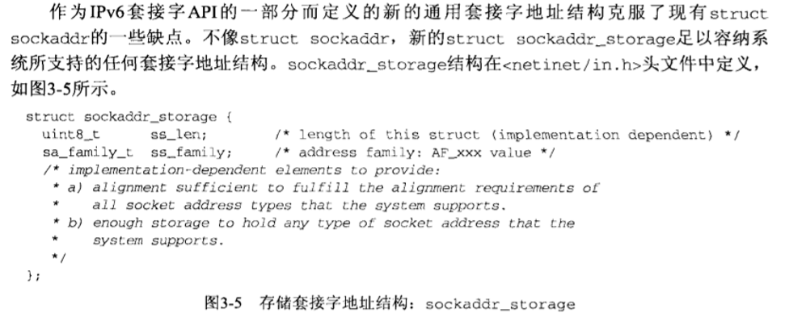

### 3.1 tcp状态变迁:
> 
### 3.2 ipv4套接字地址结构
> 
### 3.3 ipv6套接字地址结构
> 
### 3.4 通用套接字地址结构
> 
### 3.5 字节序转换函数
> 
### 3.6 字节操纵函数
> 
### 3.7 inet函数
> 
注意第二个函数返回的是一个类型`in_addr_t`而第三个函数的参数是一个结构`struct in_addr`包含了类型in_addr_t的一个成员`s_addr`
### 3.8 inet新函数
> 
inet函数主要用于ip地址的表达式和数值之间的转换.
### 3.9 sockntop函数
> 
解决了ipv4和ipv6需要分开编程的不足.即上述的inet_ntop需要传入`AF_INET`或`AF_INET6`的问题.
>
> **blahblah:** TCP为每个套接字都开辟了一个数据缓冲区.
### 3.10 readn等函数
> 

## 4 tcp套接字
> 
### 4.1 socket函数
```C
#include<sys/socket.h>
int socket(int family, int type, int protocol);
//成功则返回描述符,否则返回-1;
```
`family`指定协议族:
family|说明|
---|:--:
AF_INET|IPv4协议
AF_INET6|IPv6协议
AF_LOCAL|Unix域协议
AF_ROUTE|路由套接字
AF_KEY|密钥套接字
`type`常值:
type|说明|
---|:--:
SOCK_STREAM|字节流套接字
SOCK_DGRAM|数据报套接字
SOCK_SEQPACKET|有序分组套接字
SOCK_RAW|原始套接字
*protocol一般使用默认0即可*

### 4.2 connect函数
```C
#include<sys/socket.h>
int soconnect(int sockfd, const struct sockaddr* servaddr, socklen_t addrlen);
//成功则返回描述符,否则返回-1;
```
> 客户端在调用connect之前不必调用bind函数,因为如果需要的话,内核会确定源IP地址,并选择一个临时端口作为源端口
> 如果是TCP套接字,调用connect则会激发TCP的三次握手,仅在连接成功或失败后才返回.
> *返回错误的情况*:
>1. tcp客户端没有收到syn响应,则返回ETIMEDOUT错误,
>2. 若对客户端syn响应为rst,则表明服务器主机在我们指定端口上没有进程在等待与之连接,是**硬错误**
>3. syn在路由器中发生了ICMP错误,(比如不准分片但是超出了MTU等)认为是**软错误**,则客户继续按照超时重传发送syn.
>
> 若connect失败,则该套接字不再可用,需要关闭再重新申请
### 4.3 bind函数
```C
#include<sys/socket.h>
int bind(int sockfd, const struct sockaddr* myaddr, socklen_t addrlen);
//成功则返回0,否则返回-1;
```
> 
> 如果指定端口为零,则内核在bind**调用时就**临时指派一个端口,如果指定ip地址为通配地址,内核等到套接字已连接(TCP)或者在套接字上发送udp数据报时才会选择一个**本机**IP地址
> 对IPv4来说,通配地址为INADDR_ANY,值一般为0;
> ipv6需要改写:
```C++
struct sockaddr_in6 serv;
serv.sin6_addr = in6addr_any;
// in6addr_any是一个变量,初始化为IN6ADDR_INY_INIT
```
如果内核选定端口,需要调用`getsockname`来返回协议地址,因为`bind`返回值只有0或1;
### 4.4 listen函数
```C++
#include<sys/socket.h>
int listen(int sockfd, int backlog);
```
> **仅由TCP服务器调用**,通常用于`bind`和`socket`之后
> 当`socket`创建一个套接字时,内核默认其被用于`connect`,**称为主动套接字**而`listen`将未使用的套接字转化成被动套接字,根据TCP状态转换图,该套接字将直接从`close`状态转换成`listen`.
> `backlog`规定内核应该应该为相应套接字建立的最大syn队列

> 
> 内核为每个**监听套接字**维护两个队列.backlog为未完成连接队列即`SYN_RCVD`状态的最大套接字个数.
> 未完成连接队列中的存留时间为一个RTT.

### 4.5 accept函数
```C++
#include<sys/socket.h>
int accept(int sockfd, struct sockaddr * cliaddr, socklen_t *addrlen);
// 成功返回非负描述符,错误返回1
```
参数`cliaddr`和`addrlen`用来返回已连接的对端进程(客户端)的协议地址.`addrlen`是值-结果参数.
**值-结果参数概念:**
```
当函数参数是从 内核 到 进程 时：
函数被调用时，参数大小是一个值，进程告诉内核该参数的结构大小避免内核写操作越界；
函数返回时，参数的结构大小又是一个结果，应用进程可以知道内核所写数据的大小。

往往涉及到两个参数：存储数据的结构体指针 和 存储结构体大小的整数指针
```
返回的成功结果是一个**全新描述符**称作**已连接套接字**,代表与客户的TCP连接,`accep`的第一个参数为**监听套接字**,(由`socket`创建,随后用作`bind`和`listen`的第一个参数.)
**监听套接字和已连接套接字的区别**:一个服务器进程通常仅有一个**监听套接字**,为每个客户连接创建一个**已连接套接字**,当完成对某个客户的服务时,关闭对应**已连接套接字**;
```C++
// 具体程序解释,更加直观理解
#include<sys/socket.h>//套接字函数
#include<arpa/inet.h>//inet通用函数
#include<netinet/in>//套接字地址结构
#include<string.h>//ASCII码转换函数
#include <stdio.h>
#include <sys/types.h>
#include <unistd.h>
#include <ctype.h>
#include <strings.h>
#include <sys/stat.h>
#include <pthread.h>
#include <sys/wait.h>
#include <stdlib.h>
#define LISTENQ 1024
//自己定义的backlog,syn请求队列最大的数量

int main(int argc, char * argv[]){
    int listenfd, connfd;//define listenfd and connfd
    socklen_t len;//define length of socketinfo
    struct sockaddr_in servaddr, cliaddr;//client and server socketinfo
    char buff[1024];//buffer
    time_t ticks;

    listenfd = socket(AF_INET, SOCK_STREAM, 0);//acquire listenfd

    bzero(&servaddr, sizeof(servaddr));//set zero
    servaddr.sin_family = AF_INET;//ipv4 protocol
    servaddr.sin_addr.s_addr = htonl(INADDR_ANY);//host to net long
    servaddr.sin_port = htons(13);//daytime server port

    bind(listenfd, (struct sockaddr*)&servaddr, sizeof(servaddr));//bind listenfd with server socketinfo

    listen(listenfd, LISTENQ);          //LISTENQ为backlog参数,预定义;
    printf("EZdaytime server establised!\n");//自己加的
    for( ; ; ){//while(1) loop
        len = sizeof(cliaddr);
        connfd = accept(listenfd, (struct sockaddr*)&cliaddr, &len);
        printf("connection from %s, port %d\n",inet_ntoa(cliaddr.sin_addr), ntohs(cliaddr.sin_port));
        //第二个参数可以用inet新函数如inet_ntop(AF_INET, &cliaddr.sin_addr, buff, sizeof(buff))
        //也可用sock_ntop((struct sockaddr*)cliaddr, sizeof(cliaddr)),这个unix书作者自己包裹的一个函数.
        printf("connection established!\n");//自己加的
        ticks = time(NULL);
        snprintf(buff, sizeof(buff), "%.24s\r\n",ctime(&ticks));
        write(connfd, buff, strlen(buff));//将unix时间写入套接字缓冲区,由内核接手.
        close(connfd);                //完成客户请求之后关闭TCP连接.
        printf("connection closed\n");//自己加的
    }
}
```
### 4.5.5 成功运行上述daytime服务器
>
>首先可以看到服务器端运行了`xinet`守护进程`deamon`,即开启了`daytime`服务器.当`stop`该服务之后,`nc localhost daytime`无返回日期(上终端的第二个`nc`命令)
> 当以超级身份运行了在桌面编译的`daytime`服务端程序后,新打开终端,分别用两个地址进行访问daytime服务,皆收到了回应,且服务端显示出了访问来源的地址与端口.

### 4.6 fork和exec函数
> 并发编程的基础.
````C++
#include<unistd.h>
pid_t fork(void);
```
> `fork()`特性:返回两次,在父进程中返回一次,返回子进程的pid,子进程中又返回一次,返回0;
> **原因:** 任何子进程只有一个父进程,调用`getppid`即可获得父进程pid,而父进程却可能有多个子进程,需要返回子进程的`pid`以便跟踪
> ***重点的重点:*** 父进程中调用`fork()`之前打开的所有描述符即`sockfd`在`fork()`之后由子进程分享.通常情况:子进程中继续对该`sockfd`进行读写,而父进程关闭该`sockfd`;**每个sockfd**都有**引用计数**,当计数为零时才关闭`sockfd``
#### fork()的典型用法:
1. 一个进程创建一个本身的副本,这样每个副本都可以在另一个副本执行其他任务的同时处理各自的操作.**这是网络服务器的典型用法**
2. 首先调用`fork()`创建自身的副本,其中一个副本调用exec把自身替换成新的程序.这是`shell`之类的典型用法.
> **exec:**
> * 在硬盘上的文件被unix执行的唯一方法是:由一个现有进程调用六个(不同名,前缀都是exec)`exec`函数中的一个,`exec`把**当前进程映像替换成新的文件**,新程序通常**从main函数开始执行**
> * **进程的id并不改变**我们成调用exec的进程为**调用进程**称新的执行程序为**新程序**
> * 六个exec的区别在于:
> a.待执行的程序是由**文件名**还是**路径名**给出.
> b.新程序的参数是**一一给出**还是由**一个数组指针**来给出
> c.把**调用进程的环境传递给新程序**还是**给新程序指定新的环境**
> 该些函数只有在**出错的时候**才会返回到调用程序.
```C++
#include <unistd.h>
int execl(const char *pathname, const char *arg, ...)
int execv(const char *pathname, char *const argv[])
int execle(const char *pathname, const char *arg, ..., char *const envp[])
int execve(const char *pathname, char *const argv[], char *const envp[])
int execlp(const char *filename, const char *arg, ...)
int execvp(const char *filename, char *const argv[])
```
> 通常来说`execve`是内核调用,其他五个都是调用`execve`的库调用
> 
> * 上三个`arg`都是独立字符串变量,以一个空字符串结尾,因为没有`argc`参数'
> 下三个都是`argv`即`char*`数组
> * 左两个指定`filename`,用当前`PATH`变量把文件名转换成路径名,如果`filename`有'/'就不再使用`PATH`环境变量,右四个`path`变量唯一限定了文件的存在.
> * 左四个无环境指针,右两个有环境指针,以一个空指针结束.
> * 调用`exec`之前打开的sockfd跨exec依旧打开.
```C++
//并发服务器轮廓:
pid_t pid;
int listenfd, connfd;
listenfd = socket(...);
//填入sockaddr_in的port,sin_addr,sin_family
bind(listenfd,...);
listen(listenfd,LISTENQ);
for( ; ;){
    if((pid = fork()) == 0){
        close(listenfd);
        doit(connfd);
        close(connfd);
        exit(0);
    }
    close(connfd);//shutdown可在引用计数不为零时发送FIN
}
```
### 4.7 getsockname和getpeername函数
```C++
#include<sys/socket.h>
int getsockname(int sockfd, struct sockaddr *localaddr, socklen_t *addrlen);
int getpeername(int sockfd, struct sockaddr *peeraddr, socklen_t *addrlen);
```
> 最后一个参数都是值-结果参数.结果都装填到`localaddr`和`peeraddr`指向的地址中去.
> * 在没有`bind`的**TCP客户端**上,`connect`返回后,`getsockname`返回内核分配的本地IP地址和本地端口号,即用于和`connect`对象连接的`sockaddr`
> * 以端口0调用`bind`后,`getsockname`返回内核分配的本地端口号
> * 在一个以通配符调用`bind`的TCP服务器上,一旦`accept`(连接成功后)后,`getsockname`返回内核赋予该连接的本地IP地址.该调用中,`sockfd`必须是`connfd`,而不是`listenfd`

## 5 TCP客户/服务器程序实例
### 5.1 回射服务器
> 从客户标准输入获得文本发送给服务器,
> 服务器读改行文本,回射给客户,
> 客户读取回射文本,显示在标准输出上
### 5.3 回射服务器程序str_echo函数
```C++
void std_echo(int sockfd){
    ssize_t n;
    char buf[MAXLINE];
again:
    while((n = read(sockfd, buf, sizeof(buf))) > 0){
        write(sockfd, buf, n);
    }
    if(n < 0 && errno == EINTR)
        goto again;//神奇居然有goto语句.
    else if(n < 0)
        err_sys("str_echo: read error");
}
```
### 5.4 回射客户程序
```C++
int
main(int argc, char **argv)
{
	int					sockfd;
	struct sockaddr_in	servaddr;

	if (argc != 2)
		err_quit("usage: tcpcli <IPaddress>");

	sockfd = Socket(AF_INET, SOCK_STREAM, 0);

	bzero(&servaddr, sizeof(servaddr));//#define bzero(ptr,n) memset(ptr, 0, n)
	servaddr.sin_family = AF_INET;
	servaddr.sin_port = htons(SERV_PORT);
	Inet_pton(AF_INET, argv[1], &servaddr.sin_addr);

	Connect(sockfd, (SA *) &servaddr, sizeof(servaddr));

	str_cli(stdin, sockfd);		/* do it all */
    //把stdin当做文件句柄处理

	exit(0);
}
```
### 5.5 回射客户程序:str_cli函数
```C++
#include"unp.h"
void str_cli(FILE *fp, int sockfd){//defined in lib
    char sendline[MAXLINE], recvline[MAXLINE];
    while(Fgets(sendline, MAXLINE, fp) != NULL){//包裹函数,只有读到文件尾才返回NULL
        Writen(sockfd, sendline, strlin(sendline));//包裹函数
        if(Readline(sockfd, recvline, MAXLINE) == 0)//Readline是unp中定义的包裹函数
            eqq_quit("str_cli: server terminated permaturely");
        Fputs(recvline, stdout);
    }
}//ctrl+D 为terminal eof字符
```
### 5.5 posix信号处理
信号:告知某个进程发生了某个事件的通知,也称为软件中断.信号通常是异步发生的,也就是说**进程预先不知道信号发生的准确时刻**
信号来源:
* 进程间发送(包括自身)
* 内核发送给进程.
每个信号都有一个与之关联的**处置**,也称为**行为**通过调用`sigaction`函数来设定一个信号的处置,并有三种选择:
1. 提供一个函数,只要有特定信号发生它就被调用,这样的函数成为**信号处理函数(signal handler)**,这种行为称为**捕获信号**,只有`SIGKILL`和`SIGSTOP`不能被捕获.
信号处理函数由信号值当做单一参数来处理,没有返回值.例如: void handler(int signo)
2. 把某个信号的处置设定为`SIG_IGN`来忽略.同样`SIGKILL`和`SIGSTOP`不能忽略.
3. 设定为`SIG_DEL`,启用默认处置.

### 5.6 posix信号处理
```C++
//signal 函数
Sigfunc * signal(int signo, Sigfunc *func){
    struct sigaction act, oact;

    act.sa_handler = func;
    sigemptyset(&act.sa_mask);//将sa_mask置为空表示没有信号会被阻塞
    act.sa_flags = 0;
    if(signo == SIGALRM){
#ifdef SA_INTERRUPT//宏定义设置标志,不同操作系统对被系统中断的调用的处理,比如说自动重启或者
        act.sa_flags |= SA_INTERRUPT;
#endif
    } else {
#ifdef SA_RESTART
        act.sa_flags |= SA_RESTART;
#endif
    }
    if(sigaction(signo, &act, &oact) < 0)
        return(SIG_ERR);
    //调用sigaction函数,并将旧行为作为返回结果.
    return(oact.sa_handler);
}
//原signal void (*signal(int signo, void (*func) (int)))(int);
//定义 typedef void Sigfunc(int);
//表明是一个返回(接受一个int参数的函数指针的)函数,其参数为(int signo, Sigfunc *func);
//signal函数简化成: Sigfunc *signal(int signo, Sigfunc *func)
```
**POSIX信号语义:** 为什么要叫语义?
* 一旦安装了信号处理函数,(**应该就是设置了`signal`函数**),它便一直安装着.
* 信号处理函数运行期间,正备递交的信号是阻塞的,(就是说处理完上一个信号才会继续处理下一个信号),另外`sa_mask`指定的信号也会被阻塞
* 如果一个信号被阻塞期间产生了一次或多次,解除阻塞之后也一般只提交一次.比如说阻塞了`SIG1`和`SIG2`,再次出现`SIG2`,不会再在尾部添加一个`SIG2`
### 5.7 处理SIGCHLD信号
为了子进程 不成为僵死进程,(主要是内核空间资源)`fork`之后都得`wait`他们;这里建立一个俘获`SIGCHLD`信号的信号处理函数.一般在`listen`之后,如:`signal(SIGCHLD, sig_chld)`
```C++
void
sig_chld(SIGCHLD, sig_chld){
    pid_t pid;
    int stat;

    pid = wait(stat);
    printf("child %d terminated\n", pid);//一般不在信号处理函数中采用标准io
    return;
}
```
例如上一个回射程序中:
> * 客户键入`ctrl + D`发送`EOF`,客户端发送一个`FIN`给服务器,服务器响应以一个`ACK`
> * 收到客户端的FIN导致服务器`TCP`递送一个`EOF`给进程阻塞的`Readline`,子进程终止.
> * 当`SIG_CHLD`信号提交是,父进程阻塞于`accept`,内核使`accept`返回一个`EINTR`错误,父进程不处理该错误,于是终止.
> **主要是为了说明**我们必须认清被中断的系统调用且处理他们.

**慢系统调用:**
如上述`accept`函数,多数网络支持函数都属于这类.其他慢系统调用例如管道和终端设备读写.
*基本规则:* 阻塞于某个慢系统调用,一个进程捕获某个信号且相应的信号处理函数返回时,该慢系统调用返回一个`EINTR`,有些系统自动重启被中断的系统调用,但是我们编程中必须对这一点注意.
* `accept`,`read`,`write`,`select`,`open`等适用自己重启被中断的调用.不过:**connect**不能自己重启,因为被中断之后,如果再次调用会立即返回错误,此时必须调用`select`来等待连接完成.
### 5.7 wait和waitpid函数
由于信号不排队,因此wait可能不能完全清除所有的子僵死进程,因此需要用waitpid;
```C++
//waitpid version
void sig_chld(int signo){
    pid_t pid;
    int stat;
    while((pid = waitpid(-1, &stat, WHOHANG)) > 0)
        printf("child %d terminated\n", pid);
    return;
}
```
实质:
1. 当fork子进程时,必须捕获`SIGCHLD`信号,
2. 当捕获信号时,必须处理被中断的系统调用
3. `SIGCHLD`的信号处理函数必须正确编写,确保无僵死进程留下.
## 6 I/O复用:select和poll函数
### 6.1概述
`I/O`就是一种提前通知内核,当内核发现进程指定的一个或多个`I/O`条件就绪,就通知进程.这种能力称作`I/O`复用.
适用于:
* 客户处理多个描述符(比如服务器返回和标准设备输入)
* 客户处理多个套接字(比较少见)
* `TCP`既要处理监听套接字又要处理已连接套接字
* 既要`TCP`,又要`UDP`
* 服务器处理多个服务或多个协议.
### 6.2 五种I/O模型.
**阻塞式`I/O`**.-- **非阻塞式`I/O`**.-- **`I/O`复用** --.**信号驱动式`I/O`**.-- **异步`I/O`**
### 6.3 select函数
```C++
#include<sys/select.h>
#include<sys/time.h>
int select (int maxfdpl, fd_set *readset, fd_set *writeset, fd_set *exceptset, const struct timeval * timeout);
//有描述符返回描述符数量,超时返回1,出错-1;
```
```C++
struct timeval{
    long tv_sec; /*seconds*/
    long tv_usec;/*microseconds/
};
```
改参数的可能性:
1. 永远等下去,仅有一个描述符准备好`I/O`才返回.此时`timeout = NULL`
2. 等待一端固定时间,在有一个描述符准备好`I/O`才返回,但不超过`timeout`指向结构中的秒和毫秒.
3. 不等待,检查之后立即返回,成为轮询.`timeout`指向一个为零的结构.
(小细节,采用位来标记描述符,比如说readset是一个整数数组,该机器上整数为32位,0-31位来标记0~31描述符)
定义了四个宏函数:
> 1. void FD_ZERO(fd_set *fdset);
> 2. void FD_SET(int fd, fd_set *fdset);//置位
> 3. void FD_CLR(int fd, fd_set *fdset);//取消置位
> 4. void FD_ISSET(int fd, fd_set *fdset);//查询是否置位
如果对其中的`readset`或者`writeset`或`exceptset`不感兴趣,就置空,如果三个都空,则该函数就变成了高精度`sleep()`
>
>**fdset不可复用的原因:**
> * `select`函数返回时,我们需要一个一个位置查询`FD_ISSET`,而后描述符集内任何与未就绪描述符对应的位返回时均清0,为此,每次重新调用`select`时,都得再次把关心的描述符对应位置置1;
>
>**准备好读的条件:**
>* 该套接字**接收缓冲区的数据字节数**大于等于**套接字接收缓冲区低水位标记**的当前大小
>* 该连接的**读**半部关闭,也就是接受了`FIN`的`TCP`连接
>* 该套接字是一个监听套接字,且已完成的连接数不为零.
>* 其有一个套接字错误待处理.
>
>**准备好写的条件:**
>* 该套接字**发送缓冲区的数据字节数**大于等于**套接字发送缓冲区低水位标记**的当前大小
>* 该连接的**写**半部关闭,对这样的套接字写会产生`SIGPIPE`信号
>* 使用非阻塞式`connect`的套接字已建立连接,或者`connect`已经失败.
>* 其有一个套接字错误待处理.
>
>**如果一个套接字存在外带数据或者仍处于外带标记.
### 6.4 批量输入
由于缓冲区及各种函数如fputs等函数的存在,导致普通读行而不考虑是否还存在未读的数据通常会引发问题.
### 6.5 shutdown函数
和`close`的不同
`close`对`fd`引用计数减一,直到`fd`引用计数为零才关闭.
`close`关闭读写两个通道.
> 调用`shutdown`可以仅关闭一个方向的传输.
```C++
#include<sys/sock.h>
int shutdown(int sockfd, int howto);//成功为0否则为-1;
```
`howto`决定了行为:
> * `SHUT_RD`
> * `SHUT_WR`
> * `SHUT_RDWR`
### 6.6 select模型
```C++
//直接进入while(1) loop
for( ; ; ){
    rset = allset;
    nready = Select(maxfd + 1, &rset, NULL, NULL, NULL);

    if(FD_ISSET(listenfd, &rset)){  /*new client connection*/
        clilen = sizeof(cliaddr);
        connfd = Accept(listenfd, (SA *)cliaddr, &clilen);

        for ( i = 0; i < FD_SETSIZE; i++)
            if(client[i] < 0){
                client[i] = connfd; /*save new descriptor*/
                break;
            }
        if(i == FD_SETSIZE)
            err_quit("too many clients");

        FD_SET(connfd, &rset);      /*add new description to set*/
        if(connfd > maxfd)
            maxfd = connfd; /*for select*/
        if(i > maxi)
            maxi = i;       /*max index in client[] array*/
        
        if(--nready <= 0)
            continue;       /*no more readable descriptions*/
    }
    for(i = 0; i < maxi; i++){
        if((sockfd = client[i]) < 0)
            continue;
        if(FD_ISSET(sockfd, &rset)){
            if((n == Readn(sockfd, buf, MAXLINE)) == 0){
                /*connection closed by client*/
                Close(sockfd);
                FD_CLR(sockfd, &rset);
                client[i] = -1;
            }else{
                Writen(sockfd, buf, n);
            }

            if(--nready <= 0)
                break;      /*no more readable descriptions*/
        }
    }
}
```
> 主要的缺陷:
> * 需要对于`maxi`个`fd`进行轮询
>* `fdset`不能复用(这么看起来好像可以复用?)
### 6.6 poll模型
```C++
#include<poll.h>
int poll(struct pollfd *fdarray, unsigned long nfds, int timeout);
//若有描述符返回数目,否则-1,超时0
struct pollfd{
    int fd;
    short everts;   /*events of interest on fd*/
    short revents;   /*events that occurred on fd*/
};
```
下图为events和revents的参数.


**timeout选项:**
> `INFTIM`:永远等待&emsp;`0`:不等待,即不阻塞,`>0`:等待毫秒数
```C++
//poll 模型
for( ; ; ){
    nready = poll(client, maxi + 1, INFTIM);
    if(client[0].revents & POLLRDNORM){     /*new client conection*/
        clilen = sizeof(cliaddr);
        connfd = Accept(listenfd, &cliaddr, clilen);

        for( i = 1; i < OPEN_MAX; i++){
            if(client[i].fd = -1){
                client[i].fd = connfd;
                break;
            }
        }

        if(i == OPEN_MAX)
            err_quit("too many clients");
        
        client[i].events = POLLRDNORM;
        if(i > maxi)
            maxi = i;       /*max index in client[] array*/
        
        if(--nready <= 0)
            continue;       /*no more readable descriptions*/
    }
    for( i = 1; i < maxi + 1; ++i){
        if((sockfd = client[i].fd) < 0)
            continue;
        if(client[i].revent & (POLLRDNORM | POLLERR)){
            if((n = read(sockfd, buf, MAXLINE)) < 0){
                if(errno == ECONNRESET){
                        /*connection reset by client*/
                    Close(sockfd);
                    client[i].fd = -1;
                }else
                    err_sys("read error");
            }else if(n == 0){
                    /*connection closed by client*/
                Close(sockfd);
                client[i].fd = -1;
            }else {
                Writen(sockfd, buf, n);
            }

            if(--nready <= 0 )
                break;
        }
    }
}
```
## 7套接字选项
### 7.1 getsockopt和setsockopt函数
```C++
#include<sys/socket.h>
int getsockopt(int sockfd, int level, int optname, void *optval, socklen_t oplen);
int setsockopt(int sockfd, int level, int optname, void *optval, socklen_t oplen);
//成功为0,否则-1;
```
* `sockfd`必须指向已经打开的套接字.`level`指定系统中解释选项的代码或为通用套接字代码,或为某个特定于协议的代码.
* `optval`指向某个变量的指针.`setsockopt`函数内核从`optval`指向的变量中获得值,而`getsockopt`将值放入其中.`oplen`指定了指向的结构大小,对于`set`是一个值参数,对于`get`是一个值-结果参数

**套接字层和IP层汇总**


**传输层套接字汇总**


### 7.3 套接字状态
下面的套接字选项是TCP已连接套接字从**监听套接字**继承来的.
> `SO_DEBUG`&emsp;`SO_DONTROUT`&emsp;`SO_KEEPALIVE`&emsp;`SO_LINGER`&emsp;`SO_OOBINLINE`&emsp;`SO_RCVBUF`&emsp;`SO_RCVLOWAT`&emsp;`SO_SNDBUF`&emsp;`SO_SNDLOWAT`&emsp;`TCP_MAXSEG`&emsp;`TCP_NODELAY`&emsp;
> **原因**:TCP三次握手之后才会返回已连接套接字,如果要设置这些,必须先给监听套接字设置该选项.
### 7.4 通用套接字选项
**7.4.1** SO_BROADCAST
开启或者关闭广播消息的能力.只有在以太网或令牌环网才能广播,不能在基于连接的协议上广播(TCP,SCTP),当用户键入ip地址时,交给内核处理该地址是否是广播地址,如果是则返回错误.(如果关闭了广播选项的话)
**7.4.2** SO_DEBUG
仅由TCP支持,当开启时,为该TCP套接字发送和接收的所有分组保留详细跟踪信息.信息保存在内核某个环形缓冲区中.并可用trpt程序进行检查.
**7.4.3** SO_DONTROUTE
外出的分组绕过底层协议的正常路由机制.**路由守护进程(routed和gated)** 经常使用本选项来绕过路由表.
**7.4.4** SO_ERROR
当一个套接字发生错误时,内核将该套接字的so_error的变量设为标准的Unix Exxx值中的一个.并通知进程:
1. 进程阻塞于select调用,无论检查可读还是可写,均返回,并设置其中一个或所有两个条件.
2. 采用信号`I/O`,就给进程产生一个`SIGIO`信号,进程可以访问`SO_ERROR`的套接字选项获取`so_error`的值,由`getsockopt`返回的整数值就是该套接字待处理的错误.`so_error`随后被内核恢复为零
&emsp;&emsp;当进程调用`read`并没有返回时,如果`so_error`为非零,则`read`返回-1且`errno`设置成`so_error`的值.*(errno在头文件errno.h中,记录了系统最后一次错误代码)*,若`read`有数据,则返回数据.

**7.4.5** SO_KEEPALIVE
如果设置保持存活之后,2小时内套接子无数据交换,则`TCP`给对端发送一个**保持存活探测分节**
**7.4.6** SO_LINGER
指定close函数面对**面向连接的协议**如何处理.
```C++
struct linger{
    int l_onoff;
    int l_linger;
};//内核和用户进程之间传递的结构,定义在sys/socket.h
```
如果`l_onoff`为0,则关闭本选项,如果`l_onoff`非0而`l_linger`为0则`close`时终止该连接,否则内核拖延一段时间关闭该套接字.
如果发送缓冲区仍有数据,则发送完并被对方确认**或者**拖延时间到.
**7.4.7** SO_OOBINLINE
开启之后,带外数据,被留在正常的输入队列中.这时,接收函数的MSG_OOB标志不能用于读带外数据
**7.4.8** SO_RCVBUF和SO_SNDBUF
允许更改默认缓冲区大小.**函数的调用顺序很重要**
客户需要在`connect`之前设置,服务器在调用`listen`之前**给监听套接字**设置.
TCP套接字缓冲区大小应至少为MSS(最大报文段)的四倍.